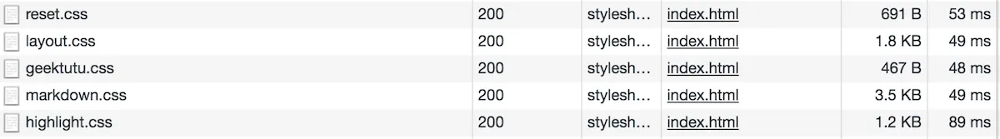

## Koa+React的尝试

一开始搭建静态博客是在2017年，大学时候买的腾讯云的服务器还没过期，就想着要么就搭个个人小站吧。2017年的时候，流量基本都往移动端转了，所以也没想着自己的博客会有多大的流量，权当是个人学习的一些记录吧。不过当时的服务器是1M1G的配置，要是一个页面超过128KB，光加载就不止1s了。现在动辄100M的家宽，这个速度是不可忍受的。当时试过了好几个博客框架，总是会引入很多JS库，有些一个小小的动画，就得引入jQuery和Bootstrap两个库，五六秒才能加载完。所以就下定决心写一个极简的框架，动画都通过原生JS实现，静态博客也不太可能有太过复杂的动画效果，引用三方库的话杀鸡用牛刀了。

当时选择的技术栈是Koa+React，为了SEO采用了服务端渲染（Server Render）的方式，每个页面大小维持在50KB左右，半秒内加载完毕，博客内的图片，上传到免费的图床。大概维护了1年左右，就无心折腾了，转向了现在的Hexo静态博客，代码归档在了[Github - React Server Render Blog](https://github.com/geektutu/hexo-theme-geektutu/tree/react-server-render-blog)。

## 转向Hexo，自己写主题

转向Hexo的原因有很多，中间有几个月太忙了，没关注博客了，后来想起来的时候，博客已经挂了好长一段时间了，不知道是服务器受攻击，还是博客框架写的有问题，宕机了。另外还有一点是，为了保证加载速度，只使用了React渲染出来的静态页面，而生成的JS太大了，JS没引入页面，而是通过写原生JS放在额外的文件里加载，这就导致，每次添加需要JS交互的功能都非常痛苦。

后来偶然发现了一个网站，[Hexo Theme](https://hexo.io/themes/index.html)，看到了很多人分享的静态主题，隐约觉得Hexo可扩展性很强，而且功能也完全能满足我的需求，因此就尝试了一下。一开始也遇到了之前页面过大的问题，很多主题看上去很不错，但是各种CSS库，JS库引用个不停，看着浏览器的小圆圈转个两秒真心是受不了了。另外再加上对自己原来设计的样式还是有点感情的，就自己动手撸主题了，这个主题也开源在了[Github - hexo-theme-geektutu](https://github.com/geektutu/hexo-theme-geektutu)。

迁移原有博客所有的样式和功能花了2天时间，写完后，惊叹于Hexo的可扩展性，包括可以定制生成文章的永久链接(permalink)，我原有博客的链接是`/post/title.html`的格式，中间试过python的静态博客框架mkdocs不支持定制。各种小功能小特性的开发效率也很高，所以迁移到Hexo的那一个月的时间，每天都处于很兴奋的状态，添加了很多之前想加但出于拖延没有加的功能。

## 极致性能之小于10KB的CSS

1. 响应式布局，裁剪了[bootstrap.css](http://v3.bootcss.com/components/)，仅使用了其中col-lg，col-md，col-sm, col-xs部分很少量的代码，图中的layout.css，仅1.8KB。
2. 兼容不同浏览器，初始化CSS， CSS Reset采用的是很小巧的[minireset.css](https://github.com/jgthms/minireset.css)，不到1KB。
3. 渲染markdown的css，采用了markdown-it的一个模板，按照自己的颜色喜好更改过，3.5KB
4. 代码高亮，选取了`night`主题的`hightlight.css`，1.1KB
5. 公共的CSS代码放在了geektutu.css，不到1K。其余，每个组件的CSS代码，都以`<style>`的形式放到了各个组件中，这样更改组件的时候，也可以很方便的把不需要的CSS删除掉，也天然支持了用谁加载谁。

整个CSS的大小不超过10K，Chrome中的测试如图：



## 极致性能之不使用任何JS库

除了**Gitalk(评论用)**和**QRious(生成二维码)**两个插件外，不引入其他的JS库。

不使用JS库，并非是排斥第三方JS库，很多库写得很优秀。比如jQuery，Bootstrap等。但是这些库是通用库，一方面实用性很广，功能强大，另一方面也就意味着随意引用的话，JS的加载量很快上去了。而且对我来说，不需要兼容IE9及以下的古董浏览器，原生的接口足够实现我的诉求了，jQuery这类似的提供兼容性接口的库对我来说也意义不大。因此，我想实现的所有动画交互效果，都完全使用原生的JS实现，并且直接内嵌在各组件页面的`<script>`标签内部，天然支持用谁加载谁的诉求。

使用原生JS实现一些动画效果，代码并没有想象中的那么复杂，比如2019年6月实现的，宽屏模式(>980px)下，点击图片，显示大图，也不过20多行代码。嵌在HTML里，也就相当于博客多写一段话了。有兴趣可以点击上面的图片看看效果。

```html
<div id="geektutu-widget-click-img-container">
    
</div>
```

```javascript
<script>
    window.addEventListener('load', function () {
        var container = document.querySelector('#geektutu-widget-click-img-container')
        var targetImg = container.querySelector('img')
        var imgs = document.querySelectorAll('article img');
        targetImg.addEventListener('click', function () {
            container.style.display = 'none';
        }, false);

        for (var i = 0; i < imgs.length; ++i) {
            var img = imgs[i];
            img.addEventListener('click', (function (src) {
                return function () {
                    if (window.innerWidth < 980) {
                        return
                    }
                    container.style.height = (window.innerHeight - 50) + 'px';
                    container.style.display = 'block';
                    targetImg.src = src;
                };
            }(img.src)), false)
        }
    })
</script>
```

实现的另一个小功能，在文章滚动的时候，右侧的目录可以高亮显示，并固定在某个位置。而这个功能也只写了40行，比想象中简单很多，所以关键是愿不愿意开始动手实现。

## 极致性能之hexo-neat库

使用[hexo-neat](https://github.com/rozbo/hexo-neat)可以对JavaScript/CSS/HTML进行压缩，HTML和CSS的压缩，一般是将空格、回车符等空字符去掉，JavaScript会复杂一些，大约可以减少20%左右的页面大小。不过我在使用的时候，不知道是什么原因，某几个模板没有渲染，所以最终没能用上，再琢磨琢磨。hexo-neat的源代码写得也很简洁，直接使用[hexo.extend](https://hexo.io/api/helper.html)提供的扩展钩子，将JavaScript/CSS/HTML的压缩工具注册进去。

## 极致性能之webp图片格式

将图片格式转换为`webp`，能降低至少1/3的大小。在线转换的工具很多，对于博客而言，图片的开销往往是一篇文章中最大的开销，如果一篇文章中图片比较多，或者有高清大图的时候，转为webp格式，那效果就明显了。
