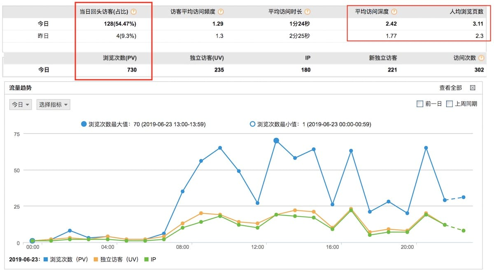
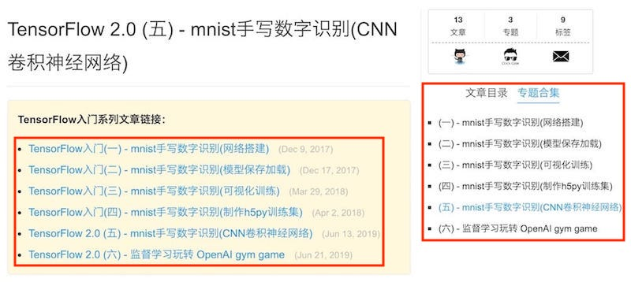
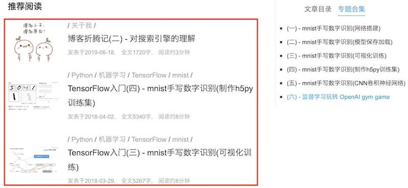

## 人均浏览页面翻倍

这周六，博客主题作了一个比较大的调整，周日`CNZZ`的统计数据显示我的人均浏览页面几乎翻倍了，立竿见影，记录下整个过程的思考。

我一直在追求一个极简的主题。之前的主题，图片很少，首页只展示所有文章的日期和标题。期望通过标题吸引感兴趣的童鞋来阅读，标签和归档页也是如此。我从六月份开始使用`CNZZ`的**站长统计**来分析我的博客流量，平常的时候流量大部分来自于`必应`和`Google`，也有从域名直接访问的。每次最新的文章发布到聚合平台上，当天会出现访问高峰，今天有**730**的PV，很多流量就来自于聚合平台。对于分享头条这件事，我变得小心谨慎了，一般是发现Google收录了之后再分享，这样就能证明我是原创了。

`CNZZ`的数据上，有一个指标我一直很关注，**人均浏览页数**。之前基本是1点几页，也就是说，别人进我的博客来，看完一篇文章，就走了。这其实也满符合直觉的。比如你搜一个关键字，点进一个网页，找到了想找的东西，目标达到了，没必要继续呆着了。这对于独立博客来说，其实是一件很蛋疼的事情。独立博客和聚合平台不一样，聚合平台有账号体系，可以点关注，这样会有持续稳定的阅读量，但是独立博客你希望别人记住你的域名或者你的博客名，这样下次才能找到你。如果人均浏览页数低，就说明你的博客 **“不重要”**，自然也不会花精力来记住你了。

那怎么才能提高人均浏览页数呢？可能你的博客里有很好的文章，成体系的分享，但是别人没有机会发现。基于此我尝试改了几个细节的地方。

## 强化专题

大部分博客，都是给自己的文章打标签，其实很多不相关的文章都会打上同一个标签，比如`Python`，不管是数据分析的，机器学习的，或者Web相关的，只要用`Python`这门语言都可以打上这个标签，那其实内容风马牛不相及。所以我在很多细节上强化了专题这个概念。因为专题范围很明确，可以写一个系列，比如`写博客从入门到放弃(一)`，一直写到`九十九`。成体系的思考是很难得的，对读者和博主都是有好处的。读者可以读到完整的内容，而不是碎片化的知识，而总结的人，可以顺着这个专题挖掘出更深的思考，更快地成长。

这是我改的几个地方：

### 1) 导航栏

首先，我将`标签`从`导航栏`移除了，变成了`专题`。

### 2) 专题框

每篇文章开头，加了一个`专题框`，呈现该文章所属专题的所有文章。一开始就提醒读者这是一个系列，是成体系的分享，下次可能还有用。

### 3) 侧边栏

`专题框`加在文章开头最大的问题是，文章读到最后，估计就懒得回到开头继续看了。所以放在侧边栏，而且总是悬浮在右侧，就容易顺着把同专题的文章一篇一篇地看完了。我改的第一版，默认展示`文章目录`，后来觉得，如果别人对你的文章感兴趣，而且文章不长的情况下，目录可能没那么重要，后来默认展示`专题合集`。如果想切换到`文章目录`也是可以的。借助浏览器的**localStorage**记录了`tab`的值。页面切换，切换的状态不会受到影响。

效果如图红框部分：



## 增加图片与推荐

每篇文章要不要加上一张图片？这个问题我一直很纠结，加上后，主题看上去就复杂了。

我最近一直在刷`medium`，`medium`每篇文章下都有三个推荐，每个推荐都有一张图作为背景。好的图片经常能抓住我的注意力，并吸引我点进去。我借鉴了这个思路，给自己的每篇文章加上了一张图，而且有些是动图。比如介绍**TensorFlow Gym**的那篇文章，我把最终的游戏效果录制了一个动画，游戏动画本身就有吸引力。如果展示在文章标题前面，必然能吸引眼球。

为此，我将文章首页改成了卡片式的瀑布流，左边是方形的图片，右边是文章的简介。

另外，每篇文章下方添加了三个推荐，这个推荐与主页的卡片是一致的，这一点借鉴了`medium`。读完一篇文章还能被下面的推荐吸引进去的话，人均浏览页面自然能上来了。而且这一点也很关键，在移动端，侧边栏是不显示的，这几个推荐在移动端很可能是文章刷到最下面唯一的流量入口了。

因为是基于**Hexo**搭的静态博客，所以也没办法做智能推荐，推荐都是随机生成的。但是每次发布新文章，整站会重新生成，所以只要更新频率快，大家会有推荐在变化的感觉。



## 增加二维码

每篇文章加了一个二维码，放到了文章最末端。微信扫一扫可以继续在手机上阅读，也很方便地分享给别人，算是一个比较贴心的细节吧。

记得有一次，我想把我的博客分享给同事，无奈只能在微信上手敲网址，就做了这个功能。

## 矛盾的彩蛋

点击屏幕的大部分区域会有彩蛋，随机弹出`点个赞`,`留个言`这类的词，颜色也是随机的。这个功能只花了30+行JavaScript代码，代码直接贴在最后了。我之前看到过这样的设计，忍不住点了好几次，觉得蛮有意思。第二天有朋友告诉我，他看我文章的时候，觉得彩蛋过于骚扰了。我仔细想了下，阅读文章的时候点击屏幕的概率不高，加个彩蛋无伤大雅。不过我最后还是将很多区域的彩蛋给去掉了，比如评论区和跳转链接。这些区域点击概率比较高，总是弹彩蛋，的确容易反感。

效果怎么样，既然实现了，先保留一段时间吧。

```javascript
// 点击随机弹出彩蛋的JavaScript代码。
<script>
(function (window, document, undefined) {
    var hearts = [];
    var keywords = ["点个赞", "留个言", "赞赏一下"];
    function randomInt(max) {
        return Math.floor(Math.random() * Math.floor(max));
    }
    window.addEventListener('click', createWord)

    function createWord(e) {
        var d = document.createElement("span");
        d.style.position = 'fixed';
        d.style.zIndex = 9999;
        d.style.color = 'rgb(' + [randomInt(255), randomInt(255), randomInt(255)].join(',') + ')';
        d.innerHTML = keywords[randomInt(keywords.length)];
        d.onselectstart = function () { return false; }

        hearts.push({ el: d, x: e.clientX - 5, y: e.clientY - 5, alpha: 1, scale: 1 });
        document.body.appendChild(d);
    }
    (function gameloop() {
        for (var i = 0; i < hearts.length; i++) {
            heart = hearts[i];
            if (heart.alpha <= 0) {
                document.body.removeChild(heart.el);
                hearts.splice(i, 1);
                continue;
            }
            heart.y -= heart.alpha < 0.5 ? 2 : 1;
            heart.scale += 0.002;
            heart.alpha -= 0.013;
            heart.el.style.transform = 'scale(' + heart.scale + ')';
            heart.el.style.left = heart.x + 'px';
            heart.el.style.top = heart.y + 'px';
        }
        setTimeout(gameloop, 10)
    })();
})(window, document);
</script>
```


