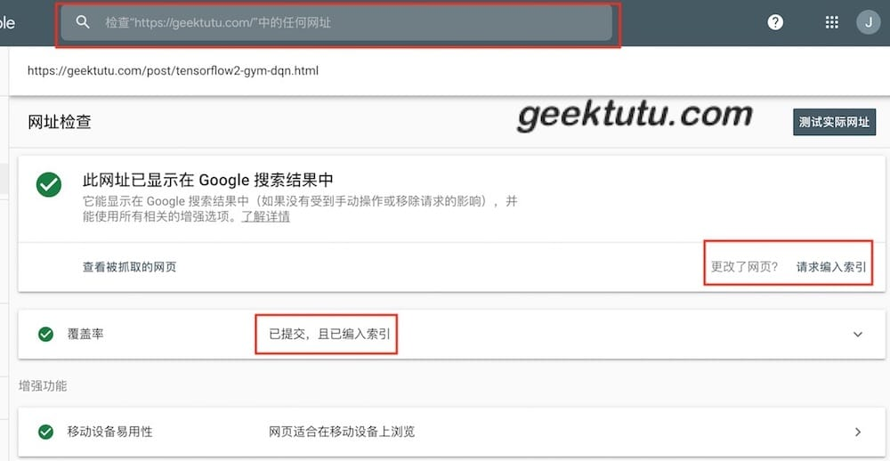
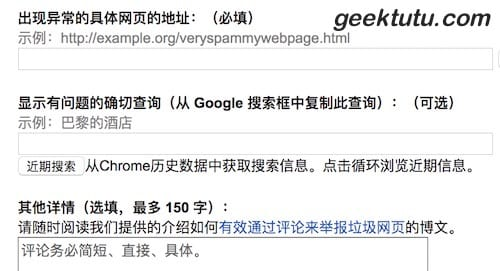
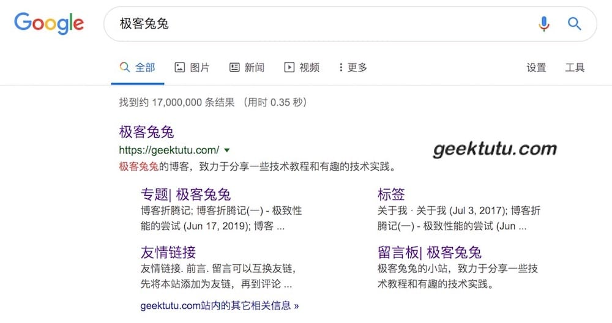

## V2EX 的帖子火了

昨天在`V2EX`发了一贴，[独立博客被各种聚合网站爬，好心累](https://v2ex.com/t/578515)，一天之内有上百个评论，五百左右的收藏，成了6月29日V2最热的帖子，这个话题的火爆程度远远超过了我的想象。而且昨天和今天，竟然给我的博客带来了接近1万的 PV。V2EX 的能量实在是太高了，贴图纪念一下。本站的数据是公开的，页面最下面的**站长统计**可以点进去看每日 PV/UV/IP 等数据。

## 重拾荒废一年的站点

这个站点，我差不多运营了一年半。今年五月前写了大概30+篇文章，每一篇都是一行一行码出来的，安装了站点统计代码，每天的 PV 在50左右徘徊，搜索引擎也不收录。大部分文章都是在刚建站半年内完成的，中间荒废了一年也没管。流量也几乎没什么变化，网站之前托管在腾讯云，还挂了好几次。

六月份的时候，一个同事偶然间提到了我的网站，突然觉得惭愧。我做事总喜欢半途而废，这个站是不是也会这样呢？前几天网站挂了，我竟然五天后才发现。我告诉自己，**这一次再试一次！好好地运营，如果这次失败就永远放弃吧。**为了专注于内容创作，我将 Koa+React 的组合换成了静态渲染框架 hexo，背景在第一篇文章中写得比较清楚：[博客折腾记(一) - 极致性能的尝试](https://geektutu.com/post/blog-experience-1.html)。舍不得原来辛辛苦苦设计的页面，因此6月6日和7日，花了两天时间，按照原来的样式从头撸了一个hexo主题：[hexo-theme-geektutu](https://github.com/geektutu/hexo-theme-geektutu)，顺手给**hexojs/site**主干提了个Pull Request，[Hexo themes](https://hexo.io/themes/index.html)列表里也有我的身影了。

花了一个周的时间整体迁移完成，那天偶然看到一篇文章，一个博主申请了`Google Adsense`30次之后，终于通过了。被拒的理由几乎都是**Valuable Inventory Scraped Content**， 即内容抄袭，他的博客有几百篇文章，每天的流量也挺大的，而且看得出也是原创博客。我的个人小站，写写总结从没想过这些。看评论的时候，大家都抱怨`Google Adsense`很难申请，技术博客都是相似的，哪有那么多原创。但是有个博主评论说，他的站点十篇文章不到，也申请通过了，关键是**原创**。我心想，我的站点也是呀，纯原创纯手工，因此我也提交了申请。Google 的效率是真高，晚上提交的申请，第二天一早就给我发了拒信，理由是**抄袭内容过多**。我看到邮件的时候，简直不敢相信自己的眼睛！！！就好比毕业论文，没有任何参考资料的前提下，写了几万字，然后查重发现，已经有人写了和你一模一样的内容。

## 别把原创资格拱手送人

`Google Adsense`的拒信让我对`原创`这两个字陷入了深深的沉思，这两周的努力，也几乎围绕着这两个字。

我做的第一件事，把原来的30+文章，按照标题中的关键字逐篇在 Google 上搜索了一遍，想看一看究竟和别人的有多大的相似程度。这一搜又把我吓了一跳。我的一篇关于 Git 的入门文章，已经被转载得面目全非了。在 CSDN 的转载排到了第一个，而我的翻了20页没找到。把所有文章都按照这种方式搜索完，我才知道，为什么被 Google 判定抄袭了。别人一字不落地转载了，由于权重高，更容易被收录，被认定原创，而我就被认定为抄袭了。

还有一些文章是我自己亲手把自己给卖了的。因为想吸引更多的人关注我的博客，每次一写完就分享链接到`掘金`和`Segmentfault`的头条版块，本以为，分享链接能给自己引流，现在才发现，当你分享链接的时候，全文也被爬取了。`Segmentfault`有个所谓的阅读模式，默认折叠起来，但是查看网页源代码的时候，可以发现，阅读模式里的原文不是动态加载的，是直接渲染成**html**中的，这意味着搜索引擎先爬到这个链接，就会认为这篇文章是`Segmentfault`原创的。而我能得到的，仅仅是在`Segmentfault`首页展示的那两天的流量，并永远地将搜索引擎的流量拱手送人了。`掘金`等其他平台也是如此。

另外，根本不能指望这些大平台里放了你的链接，能给你带来点外链权重，我分析了大部分的平台，结果很失望。

- `Segmentfault`和`CSDN`等大部分平台的原文链接，以及文章中的链接，都被加上了`rel=nofollow`属性，这个属性的含义是告诉搜索引擎，这个链接可以忽略掉，所以不能起到外链的效果。
- `掘金`和一些采集站的做法是服务器重定向，链接类似这样**https://link点juejin点im/?target=origin_url**，意味着你的链接需要通过掘金来重定向。这种做法比第一种还糟糕，这种链接是链到了平台自己，与你完全无关了。
- 第三种做法，很多无良转载者常用，将你的链接变为文本，象征性地放在文章末尾，这样不可点击。很少有人会专门复制这个链接，访问原站的。

在所有的大平台中，我唯一发现不加`nofollow`属性的平台是`博客园`。而且博客园允许定制**页首HTML**代码，如果你博客园的文章搜索量还不错，在`博客园`里发一个新博客链接，绝对有效。

就这样，80% 的文章相当于是给别人做了嫁衣。无奈之下，只能删除。最后删了只剩下6篇，tensorflow 相关的4篇和 pandas 相关的2篇。忍痛删掉20多篇文章，一个朋友知道后，觉得很不理解，原来的就放着呗，新写的注意别干蠢事就好了。如果不删除，在 Google 永远会有一个抄袭的标签，如果这个站要做下去，长痛不如短痛。

这两周，又爆肝写了几篇，好几篇文章的更新时间都是凌晨，到今天为止，加上原来的已经有14篇了。想安安静静地将原来没写完的专题继续写完，每次写完文章，都主动去`Google Search Console`手工更新`sitemap.xml`。Google 的效率很高，一般手工更新完站点地图后，5分钟就爬完了。当然，没有站点地图也可以测试单个网址，如果显示没有编入索引，点击请求编入索引，很快 Google 就会爬取相关页面，编入索引了。第一个提交，原创资格自然容易保证了。

## 积极举报抄袭网页

对于无良的转载者，我一开始没怎么注意，觉得既然都第一个提交了，他们转载不影响我的搜索排名，也不浪费精力了。但是上个周发生的一件事**简直毁三观**！

我凌晨2点更新完文章，提交到 Google 后就睡了。第二天一早无意识地搜了下相关关键字，发现一个垃圾聚合站居然排到了第一个，我的根本搜不到。然后我点进去看，发现所有指向我站点的链接全部被删除，而且他的文章在我发布10分钟后就有了。只有一个可能，这个垃圾站，将我的博客列入了爬虫名单，发现博客更新就爬取。

我用文章标题直接搜索，而且点击了 Google 搜索页面最下面的**显示全部相似的结果**，短短半天，就有4个聚合站采集了我的文章，均将我的链接移除了，只有一个站在文章最后面一个很不起眼的位置，加了`查看原文`，指向了我。而且这些站点的 Google 收录时间与我的只差了一个小时，如果权重比我高，容易认定高权重的网站为原创。我只能尽可能地联系聚合站的站长，希望他们能够删除我的文章，有1个通过微信联系，有2个通过留言，均删除了。并且告知我的文章禁止转载，口头答应，发下一篇的时候，又被无耻地采集了。还有另一个站长，网站上没有留任何的联系方式，根本找不到人。无奈之下，我发现了这个网站[Google Spam Report](https://www.google.com/webmasters/tools/spamreportform?hl=zh-CN)可以举报垃圾网页。抱着试一试的心态，举报了抄袭我文章的地址。两小时后再去搜索，居然发现我的文章排到了首页，被举报的网址搜不到了。举报是真有效！后来找到了**Google Spam Report**的浏览器插件，举报起来更是得心应手。这个周，持续不断地与无良聚合站作斗争，每天坚持举报5个以上的地址。如果第二天搜索结果还没消失，继续举报。

## 博客自身的改进

当然，博客本身也在改进。

- 每张图片加域名提示。我喜欢做一些动图，推荐用`Giphy Capture`录制 gif 动画，支持直接设置文本提示。这样即使被爬取，也能提醒读者原创的站点在哪。
- 文章中的每个代码片段注释前两行，加上域名。一般爬虫是不处理代码片段的。
- 文章最末尾，自动加上**本站域名 xxx，也可以通过搜索 xxx 找到我**，这位这段话在`<article>`标签中，一般也会被爬取。
- 服务器站点加黑名单，我用的是**对象存储服务**，支持设置黑名单，使用`DNS Checker`查到对方域名的IP地址，然后加入黑名单。但有些大的采集站，爬虫有IP池，这种方法也无能为力了。

昨天，我在`V2EX`上发了关于我这段经历的帖子，热度之高超乎我的想象。很多V友也在积极地建言献策，声讨聚合站、采集站，分享反爬措施，SEO 优化等。默默收藏的童鞋更是评论人数的N倍。做技术的人，很多都有写博客的习惯，被判抄袭，没有搜索流量，被无良转载等等，很容易产生共鸣。

也有童鞋回复我，说之前看了我的文章，对他写PJ有很大帮助，特来感谢。我回复说，对你有帮助，我感到非常开心。

对于写博客的人来说，还有什么比让读者觉得有价值更重要的事情呢？

这个帖子也让我认识了好几位坚持耕耘的独立博主，还添加了建站以来的第一条**友链**。独立博主是个小圈子，在`V2EX`发的帖子，以及写的这篇文章，都是希望能够用自己的经验帮助小圈子里面的博主们少走弯路。如果一年多前，能有人告诉我不要去`Segmentfault`、`掘金`分享链接，发文章后要第一时间提交给搜索引擎，以及发现垃圾网页及时举报等等，我想我的小站内容会比今天更丰富，说不定已经有了点权重。国内的原创环境很糟糕，稍不注意，创新的勇气会被慢慢消磨。

## 谷歌为我的小站加了导航

从重拾博客到今天，三周加一个周末，23天。博客访问量从50慢慢稳定在300左右，一个帖子，让2天有接近1万的阅读量，这些都是预料之外的。还有更意想不到的事情是，Google 竟然为我的小站添加了**导航栏**，受宠若惊。

昨晚，第二次提交`Google Adsense`申请，也通过了。

希望这篇文章能够帮助**同为原创博主的你**，不被恶化的原创环境磨平创新的棱角。

