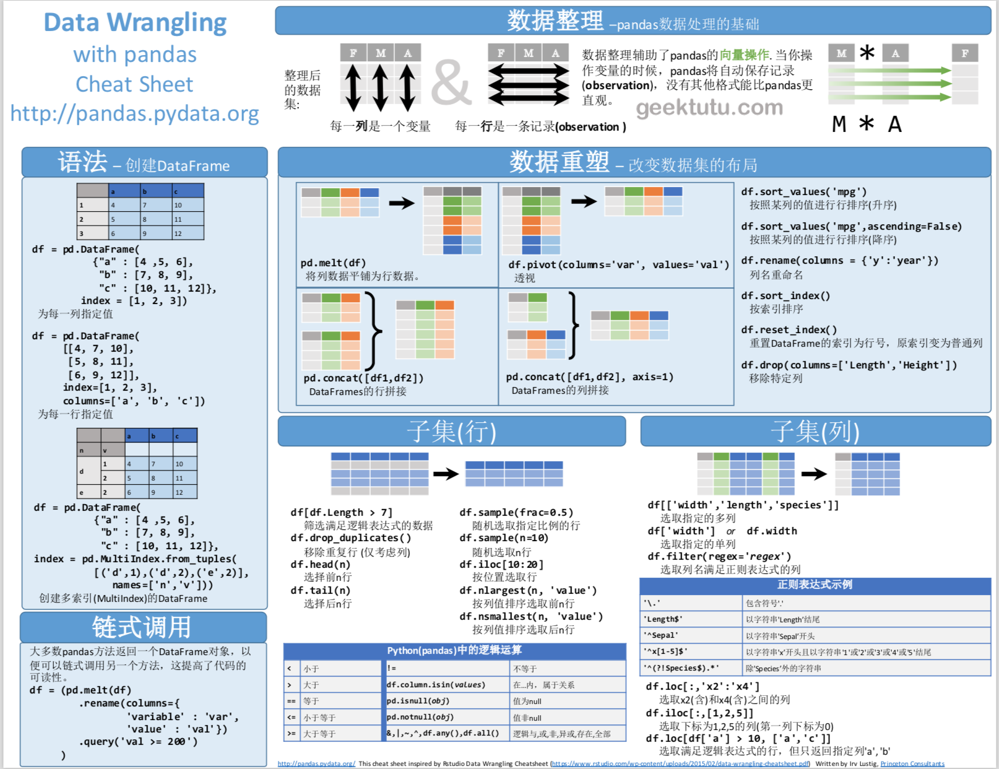
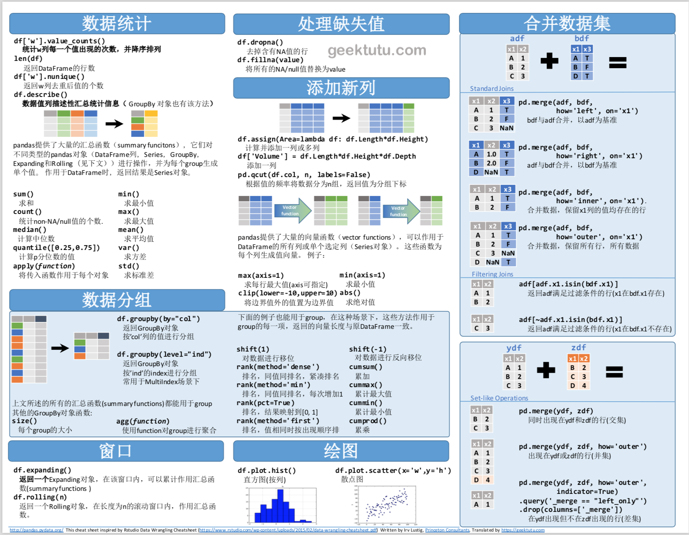

## 来源

Pandas的[英文文档](https://pandas.pydata.org/pandas-docs/stable/)内容过于庞杂，而大部分时候，我们仅仅需要其中一些较为常见的用法，查看官方文档耗时且费力，这两张图较为全面地概括了pandas的常用方法。

包括：

- 链式调用(Method Chaining)
- 数据重塑(Reshaping Data)
- 筛选数据(Subsets)
- 数据统计(Summarize Data)
- 数据分组(Group Data)
- 合并数据(Combine Data)
- 绘图(Pilot)
- ...

参考[Pandas_Cheat_Sheet.pdf](https://pandas.pydata.org/Pandas_Cheat_Sheet.pdf)，[极客兔兔](https://github.com/geektutu)于2019年6月16日翻译了中文版，如有错误，可以直接在评论区评论。

## 效果图

## PDF下载

点击查看/下载pdf版本 [Pandas_Cheat_Sheet_zh_CN.pdf](pandas-cheat-sheet-zh-cn/Pandas_Cheat_Sheet_zh_CN.pdf)

也欢迎把本文分享给对pandas感兴趣的小伙伴。
