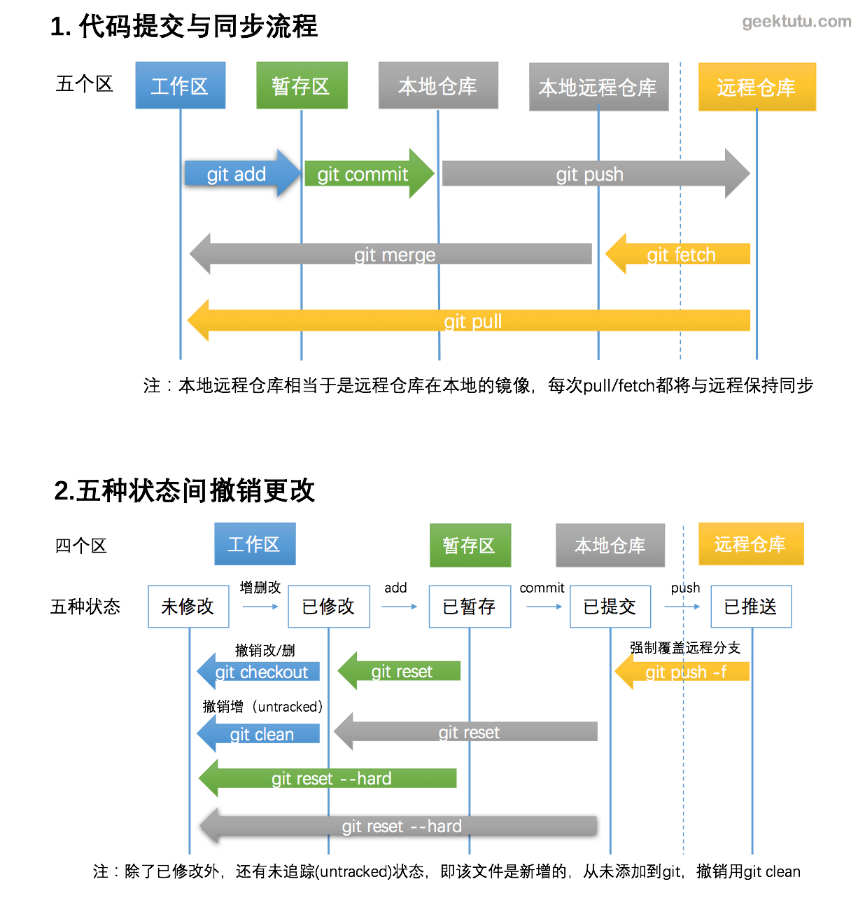

## 五种状态间的顺序操作
### 四个区
- 1) 工作区(Working Area)
- 2) 暂存区(Stage)
- 3) 本地仓库(Local Repository)
- 4) 远程仓库(Remote Repository)

### 五种状态
- 1) 未修改(Origin)
- 2) 已修改(Modified)&未追踪(Untracked)
- 3) 已暂存(Staged)
- 4) 已提交(Committed)
- 5) 已推送(Pushed)

### 顺序操作
- 第零步：工作区与仓库保持一致
- 第一步：文件增删改，变为已修改状态
- 第二步：git add ，变为已暂存状态

```
$ git add --all # 当前项目下的所有更改
$ git add .  # 当前目录下的所有更改
$ git add xx/xx.py xx/xx2.py  # 添加某几个文件
```
- 第三步：git commit，变为已提交状态

```
$ git commit -m"<这里写commit的描述>"
```
- 第四步：git push，变为已推送状态

```
$ git push -u origin master # 第一次需要关联上
$ git push # 之后再推送就不用指明应该推送的远程分支了
$ git branch # 可以查看本地仓库的分支
$ git branch -a # 可以查看本地仓库和本地远程仓库(远程仓库的本地镜像)的所有分支
```



## 五种状态间的撤销操作
### 已修改，但未暂存

```
$ git diff # 列出所有的修改
$ git diff xx/xx.py xx/xx2.py # 列出某(几)个文件的修改
```

```
$ git checkout # 撤销项目下所有的修改
$ git checkout . # 撤销当前文件夹下所有的修改
$ git checkout xx/xx.py xx/xx2.py # 撤销某几个文件的修改
$ git clean -f # untracked状态，撤销新增的文件
$ git clean -df # untracked状态，撤销新增的文件和文件夹

# Untracked files:
#  (use "git add <file>..." to include in what will be committed)
#
#	xxx.py
```

### 已暂存，未提交

> 这个时候已经执行过git add，但未执行git commit，但是用git diff已经看不到任何修改。

> 因为git diff检查的是工作区与暂存区之间的差异。

```
$ git diff --cached # 这个命令显示暂存区和本地仓库的差异
```

```
$ git reset # 暂存区的修改恢复到工作区
$ git reset --soft # 与git reset等价，回到已修改状态，修改的内容仍然在工作区中
$ git reset --hard # 回到未修改状态，清空暂存区和工作区
```
> git reset --hard 操作等价于 git reset 和 git checkout 2步操作

### 已提交，未推送

> 执行完commit之后，会在仓库中生成一个版本号(hash值)，标志这次提交。之后任何时候，都可以借助这个hash值回退到这次提交。

```
$ git diff <branch-name1> <branch-name2> # 比较2个分支之间的差异
$ git diff master origin/master # 查看本地仓库与本地远程仓库的差异
```

```
$ git reset --hard origin/master # 回退与本地远程仓库一致
$ git reset --hard HEAD^ # 回退到本地仓库上一个版本
$ git reset --hard <hash code> # 回退到任意版本
$ git reset --soft/git reset # 回退且回到已修改状态，修改仍保留在工作区中。
```

### 已推送到远程

```
$ git push -f orgin master # 强制覆盖远程分支
$ git push -f # 如果之前已经用 -u 关联过，则可省略分支名
```
> **慎用**，一般情况下，本地分支比远程要新，所以可以直接推送到远程，但有时推送到远程后发现有问题，进行了版本回退，旧版本或者分叉版本推送到远程，需要添加 -f参数，表示强制覆盖。


## 总结
- 首先，先用git status查看下当前状态。
- git reset可以作用于本地仓库，用于回退/前进到任意版本，也可以作用于暂存区，用于撤销暂存区修改。有hard和soft2个参数。soft参数可以省略，soft参数表示撤销的修改仍放在工作区中。
- git checkout用于撤销删除和修改，git clean -df用于撤销新增。
- git diff可以查看工作区、暂存区、仓库之间的修改和差异，参数不同。