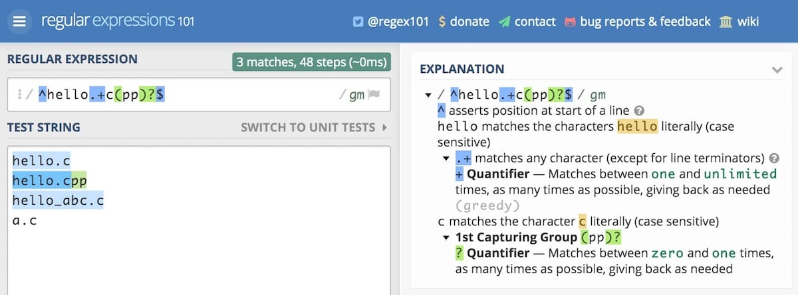

准备逐步把自己平时常用的网站和工具分享出来，希望能提高大家的效率。

## 编程

No.1 Regex101 - 在线正则表达式测试

[Regex101](https://regex101.com/)

正则表达式无非是一些规则的集合罢了，很多童鞋有正则恐怖症，不知道自己写的是否是期望的，这个网站可以帮助你克服正则恐怖症，你正则表达式中的每一个字母符号，都会告诉你具体的含义。

## 前端/设计

No.1 ColorHunt - 颜色搭配

[ColorHunt](https://colorhunt.co)

好看的配色都在这里，适合建站颜色搭配困难症。

No.2 ImageOptim - 图片压缩神器

[ImageOptim](https://imageoptim.com/mac)

一直在使用的图片压缩神器，压缩率基本在 50% 以上，本站的所有图片上传前都经过 ImageOptim 压缩。而且非常小！只有一个页面，拖进去即可！

