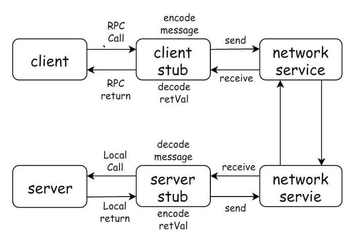

本文介绍了 Go 语言远程过程调用(Remote Procedure Call, RPC)的使用方式，示例基于 Golang 标准库 net/rpc，同时介绍了如何基于 TLS/SSL 实现服务器端和客户端的单向鉴权、双向鉴权。

## 1 RPC 简介

> 远程过程调用（英语：Remote Procedure Call，缩写为 RPC）是一个计算机通信协议。该协议允许运行于一台计算机的程序调用另一个地址空间（通常为一个开放网络的一台计算机）的子程序，而程序员就像调用本地程序一样，无需额外地为这个交互作用编程（无需关注细节）。RPC是一种服务器-客户端（Client/Server）模式，经典实现是一个通过发送请求-接受回应进行信息交互的系统。
> -- [远程过程调用 - Wikipedia.org](https://zh.wikipedia.org/wiki/%E9%81%A0%E7%A8%8B%E9%81%8E%E7%A8%8B%E8%AA%BF%E7%94%A8)

划重点：**程序员就像调用本地程序一样，无需关注细节**

RPC 协议假定某种传输协议(TCP, UDP)存在，为通信程序之间携带信息数据。使用 RPC 协议，无需关注底层网络技术协议，调用远程方法就像在调用本地方法一样。

RPC 流程：



RPC 模型是一个典型的客户端-服务器模型(Client-Server, CS)，相比于调用本地的接口，RPC 还需要知道的是服务器端的地址信息。本地调用，好比两个人面对面说话，而 RPC 好比打电话，需要知道对方的电话号码，但是并不需要关心语音是怎么编码，如何传输，又如何解码的。

接下来我们将展示如何将一个简单的本地调用的程序一步步地改造一个 RPC 服务。

示例使用 Go 语言，RPC 使用 Golang 提供的`net/rpc` 标准库

## 2 一个简单的计算二次方的程序

不考虑 RPC 调用，仅考虑本地调用的场景，程序实现如下：

```go
// main.go
package main

import "log"

type Result struct {
	Num, Ans int
}

type Cal int

func (cal *Cal) Square(num int) *Result {
	return &Result{
		Num: num,
		Ans: num * num,
	}
}

func main() {
	cal := new(Cal)
	result := cal.Square(12)
	log.Printf("%d^2 = %d", result.Num, result.Ans)
}
```

在这个20行的程序中，我们做了以下几件事：

- `Cal` 结构体，提供了 Square 方法，用于计算传入参数 num 的 二次方。
- `Result` 结构体，包含 Num 和 Ans 两个字段，Ans 是计算后的值，Num 是待计算的值。
- `main` 函数，测试我们实现的 Square 方法。

运行 main.go，将会输出

```go
$ go run main.go
2020/01/13 20:27:08 12^2 = 144
```

## 3 RPC 需要满足什么条件

虽然说，远程过程调用并不需要我们关心如何编解码，如何通信，但是最基本的，如果一个方法需要支持远程过程调用，需要满足一定的约束和规范。不同 RPC 框架的约束和规范是不同的，如果使用 Golang 的标准库 `net/rpc`，方法需要长这个样子：

```go
func (t *T) MethodName(argType T1, replyType *T2) error
```

即需要满足以下 5 个条件：

- 1) 方法类型（T）是导出的（首字母大写） 
- 2) 方法名（MethodName）是导出的
- 3) 方法有2个参数(argType T1, replyType *T2)，均为导出/内置类型
- 4) 方法的第2个参数一个指针(replyType *T2)
- 5) 方法的返回值类型是 error

`net/rpc` 对参数个数的限制比较严格，仅能有2个，第一个参数是调用者提供的请求参数，第二个参数是返回给调用者的响应参数，也就是说，服务端需要将计算结果写在第二个参数中。如果调用过程中发生错误，会返回 error 给调用者。

接下来，我们改造下 Square 函数，以满足上述 5 个条件。

```go
func (cal *Cal) Square(num int, result *Result) error {
	result.Num = num
	result.Ans = num * num
	return nil
}

func main() {
	cal := new(Cal)
	var result Result
	cal.Square(11, &result)
	log.Printf("%d^2 = %d", result.Num, result.Ans)
}
```

- Cal 和 Square 均为导出类型，满足条件 1) 和 2) 
- 2 个参数，`num int` 为内置类型，`result *Result` 为导出类型，满足条件 3)
- 第2个参数 `result *Result` 是一个指针，满足条件 4) 
- 返回值类型是 error，满足条件 5)

至此，方法 Cal.Square 满足了 RPC 调用的5个条件。

## 4 RPC 服务与调用

### 4.1 基于HTTP，启动 RPC 服务

RPC 是一个典型的客户端-服务器(Client-Server, CS) 架构模型，很显然，需要将 Cal.Square 方法放在服务端。服务端需要提供一个套接字服务，处理客户端发送的请求。通常可以基于 HTTP 协议，监听一个端口，等待 HTTP 请求。

接下来我们新建一个文件夹 server，将 Cal.Square 方法移动到 server/main.go 中，并在 main 函数中启动 RPC 服务。

```go
// server/main.go
package main

import (
	"log"
	"net"
	"net/http"
	"net/rpc"
)

type Result struct {
	Num, Ans int
}

type Cal int

func (cal *Cal) Square(num int, result *Result) error {
	result.Num = num
	result.Ans = num * num
	return nil
}

func main() {
	rpc.Register(new(Cal))
	rpc.HandleHTTP()
	
	log.Printf("Serving RPC server on port %d", 1234)
	if err := http.ListenAndServe(":1234", nil); err != nil {
		log.Fatal("Error serving: ", err)
	}
}
```

- 使用 `rpc.Register`，发布 Cal 中满足 RPC 注册条件的方法（Cal.Square）
- 使用 `rpc.HandleHTTP` 注册用于处理 RPC 消息的 HTTP Handler
- 使用 `http.ListenAndServe` 监听 1234 端口，等待 RPC 请求。

我们在 server 目录下，执行

```bash
$ go run main.go
2020/01/13 20:59:22 Serving RPC server on port 1234
```

此时，RPC 服务已经启动，等待客户端的调用。

### 4.2 实现客户端

我们在 client 目录中新建文件 client/main.go，创建 HTTP 客户端，调用 Cal.Square 方法。

```go
// client/main.go
package main

import (
	"log"
	"net/rpc"
)

type Result struct {
	Num, Ans int
}

func main() {
	client, _ := rpc.DialHTTP("tcp", "localhost:1234")
	var result Result
	if err := client.Call("Cal.Square", 12, &result); err != nil {
		log.Fatal("Failed to call Cal.Square. ", err)
	}
	log.Printf("%d^2 = %d", result.Num, result.Ans)
}
```

在客户端的实现中，因为要用到 Result 类型，简单起见，我们拷贝了 `Result` 的定义。

- 使用 `rpc.DialHTTP` 创建了 HTTP 客户端 client，并且创建了与 localhost:1234 的链接，1234 恰好是 RPC 服务监听的端口。
- 使用 `rpc.Call` 调用远程方法，第1个参数是方法名 Cal.Square，后两个参数与 Cal.Square 的定义的参数相对应。

我们在 client 目录下，执行

```bash
2020/01/13 21:17:45 12^2 = 144
```

如果能够返回计算的结果，说明调用成功。

### 4.3 异步调用

`client.Call` 是同步调用的方式，会阻塞当前的程序，直到结果返回。如果有异步调用的需求，可以考虑使用`client.Go`，如下

```go
func main() {
	client, _ := rpc.DialHTTP("tcp", "localhost:1234")
	var result Result
	asyncCall := client.Go("Cal.Square", 12, &result, nil)
	log.Printf("%d^2 = %d", result.Num, result.Ans)

	<-asyncCall.Done
	log.Printf("%d^2 = %d", result.Num, result.Ans)

}
```

执行结果如下：

```
2020/01/13 21:34:26 0^2 = 0
2020/01/13 21:34:26 12^2 = 144
```

因为 `client.Go` 是异步调用，因此第一次打印 result，result 没有被赋值。而通过调用 `<-asyncCall.Done`，阻塞当前程序直到 RPC 调用结束，因此第二次打印 result 时，能够看到正确的赋值。

## 5 证书鉴权(TLS/SSL)

### 5.1 客户端对服务器端鉴权

HTTP 协议默认是不加密的，我们可以使用证书来保证通信过程的安全。

生成私钥和自签名的证书，并将  server.key 权限设置为只读，保证私钥的安全。

```bash
# 生成私钥
openssl genrsa -out server.key 2048
# 生成证书
openssl req -new -x509 -key server.key -out server.crt -days 3650
# 只读权限
chmod 400 server.key
```

执行完，当前文件夹下多出了 server.crt 和 server.key 2 个文件。

服务器端可以使用生成的 server.crt 和 server.key 文件启动 TLS 的端口监听。

```go
// server/main.go
import (
	"crypto/tls"
	"log"
	"net/rpc"
)

func main() {
	rpc.Register(new(Cal))
	cert, _ := tls.LoadX509KeyPair("server.crt", "server.key")
	config := &tls.Config{
		Certificates: []tls.Certificate{cert},
	}
	listener, _ := tls.Listen("tcp", ":1234", config)
	log.Printf("Serving RPC server on port %d", 1234)
	
	for {
		conn, _ := listener.Accept()
		defer conn.Close()
		go rpc.ServeConn(conn)
	}
}
```

客户端也需要做相应的修改，使用 `tls.Dial` 代替 `rpc.DialHTTP` 连接服务端，如果客户端不需要对服务端鉴权，那么可以设置 `InsecureSkipVerify:true`，即可跳过对服务端的鉴权，例如：

```go
// client/main.go
import (
	"crypto/tls"
	"log"
	"net/rpc"
)

func main() {
	config := &tls.Config{
	    InsecureSkipVerify: true,
	}
	conn, _ := tls.Dial("tcp", "localhost:1234", config)
	defer conn.Close()
	client := rpc.NewClient(conn)

	var result Result
	if err := client.Call("Cal.Square", 12, &result); err != nil {
		log.Fatal("Failed to call Cal.Square. ", err)
	}

	log.Printf("%d^2 = %d", result.Num, result.Ans)
}
```

如果需要对服务器端鉴权，那么需要将服务端的证书添加到信任证书池中，如下：

```go
// client/main.go

func main() {
	certPool := x509.NewCertPool()
	certBytes, err := ioutil.ReadFile("../server/server.crt")
	if err != nil {
		log.Fatal("Failed to read server.crt")
	}
	certPool.AppendCertsFromPEM(certBytes)

	config := &tls.Config{
		RootCAs: certPool,
	}

	conn, _ := tls.Dial("tcp", "localhost:1234", config)
	defer conn.Close()
	client := rpc.NewClient(conn)

	var result Result
	if err := client.Call("Cal.Square", 12, &result); err != nil {
		log.Fatal("Failed to call Cal.Square. ", err)
	}

	log.Printf("%d^2 = %d", result.Num, result.Ans)
}
```

### 5.2 服务器端对客户端的鉴权

服务器端对客户端的鉴权是类似的，核心在于 `tls.Config` 的配置：

- 把对方的证书添加到自己的信任证书池 `RootCAs`(客户端配置)，`ClientCAs`(服务器端配置) 中。
- 创建链接时，配置自己的证书 `Certificates`。


客户端的 config 作如下修改：

```go
// client/main.go

cert, _ := tls.LoadX509KeyPair("client.crt", "client.key")
certPool := x509.NewCertPool()
certBytes, _ := ioutil.ReadFile("../server/server.crt")
certPool.AppendCertsFromPEM(certBytes)
config := &tls.Config{
	Certificates: []tls.Certificate{cert},
	RootCAs: certPool,
}
```

服务器端的 config 作如下修改：

```go
// server/main.go

cert, _ := tls.LoadX509KeyPair("server.crt", "server.key")
certPool := x509.NewCertPool()
certBytes, _ := ioutil.ReadFile("../client/client.crt")
certPool.AppendCertsFromPEM(certBytes)
config := &tls.Config{
	Certificates: []tls.Certificate{cert},
	ClientAuth:   tls.RequireAndVerifyClientCert,
	ClientCAs:    certPool,
}
```

## 附：参考

1. [Golang net/rpc 官方文档 - golang.org](https://golang.org/pkg/net/rpc/)
2. [Golang TLS 配置 - github.com](https://github.com/denji/golang-tls)
