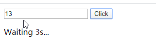

## 1 WebAssembly 简介

> WebAssembly是一种新的编码方式，可以在现代的网络浏览器中运行 － 它是一种低级的类汇编语言，具有紧凑的二进制格式，可以接近原生的性能运行，并为诸如C / C ++等语言提供一个编译目标，以便它们可以在Web上运行。它也被设计为可以与JavaScript共存，允许两者一起工作。  —— [MDN web docs - mozilla.org](https://developer.mozilla.org/zh-CN/docs/WebAssembly)

从 MDN 的介绍中，我们可以得出几个结论：

- 1）WebAssembly 是一种二进制编码格式，而不是一门新的语言。
- 2) WebAssembly 不是为了取代 JavaScript，而是一种补充（至少现阶段是这样），结合 WebAssembly 的性能优势，很大可能集中在对性能要求高（例如游戏，AI），或是对交互体验要求高（例如移动端）的场景。
- 3）C/C++ 等语言可以编译 WebAssembly 的目标文件，也就是说，其他语言可以通过编译器支持，而写出能够在浏览器前端运行的代码。

Go 语言在 1.11 版本(2018年8月) 加入了对 WebAssembly (Wasm) 的原生支持，使用 Go 语言开发 WebAssembly 相关的应用变得更加地简单。Go 语言的内建支持是 Go 语言进军前端的一个重要的里程碑。在这之前，如果想使用 Go 语言开发前端，需要使用 [GopherJS](https://github.com/gopherjs/gopherjs)，GopherJS 是一个编译器，可以将 Go 语言转换成可以在浏览器中运行的 JavaScript 代码。新版本的 Go 则直接将 Go 代码编译为 wasm 二进制文件，而不再需要转为 JavaScript 代码。更巧的是，实现 GopherJS 和在 Go 语言中内建支持 WebAssembly 的是同一拨人。

Go 语言实现的函数可以直接导出供 JavaScript 代码调用，同时，Go 语言内置了 [syscall/js](https://github.com/golang/go/tree/master/src/syscall/js) 包，可以在 Go 语言中直接调用 JavaScript 函数，包括对 DOM 树的操作。

## 2 Hello World

如果对 Go 语言不熟悉，推荐 [Go 语言简明教程](https://geektutu.com/post/quick-golang.html)，一篇文章快速入门。

接下来，我们使用 Go 语言实现一个最简单的程序，在网页上弹出 `Hello World`。

第一步，新建文件 main.go，使用 js.Global().get('alert') 获取全局的 alert 对象，通过 Invoke 方法调用。等价于在 js 中调用 `window.alert("Hello World")`。

```go
// main.go
package main

import "syscall/js"

func main() {
	alert := js.Global().Get("alert")
	alert.Invoke("Hello World!")
}
```

第二步，将 main.go 编译为 static/main.wasm

> 如果启用了 `GO MODULES`，则需要使用 go mod init 初始化模块，或设置 GO111MODULE=auto。

```bash
$ GOOS=js GOARCH=wasm go build -o static/main.wasm
```

第三步，拷贝 wasm_exec.js (JavaScript 支持文件，加载 wasm 文件时需要) 到 static 文件夹

```bash
$ cp "$(go env GOROOT)/misc/wasm/wasm_exec.js" static
```

第四步，创建 index.html，引用 `static/main.wasm` 和 `static/wasm_exec.js`。

```html
<html>
<script src="static/wasm_exec.js"></script>
<script>
	const go = new Go();
	WebAssembly.instantiateStreaming(fetch("static/main.wasm"), go.importObject)
		.then((result) => go.run(result.instance));
</script>

</html>
```

第五步，使用 goexec 启动 Web 服务

> 如果没有安装 goexec，可用 `go get -u github.com/shurcooL/goexec` 安装，需要将 $GOBIN 或 $GOPATH/bin 加入环境变量

当前的目录结构如下：

```bash
demo/
   |--static/
      |--wasm_exec.js
      |--main.wasm
   |--main.go
   |--index.html
```

```bash
$ goexec 'http.ListenAndServe(`:9999`, http.FileServer(http.Dir(`.`)))'
```

浏览器访问 localhost:9999，则会有一个弹出窗口，上面写着 *Hello World!*。


为了避免每次编译都需要输入繁琐的命令，可将这个过程写在 `Makefile` 中

```makefile
all: static/main.wasm static/wasm_exec.js
	goexec 'http.ListenAndServe(`:9999`, http.FileServer(http.Dir(`.`)))'

static/wasm_exec.js:
	cp "$(shell go env GOROOT)/misc/wasm/wasm_exec.js" static

static/main.wasm : main.go
	GO111MODULE=auto GOOS=js GOARCH=wasm go build -o static/main.wasm .
```

这样一个敲一下 make 就够了，代码已经上传到 [7days-golang - github.com](https://github.com/geektutu/7days-golang/tree/master/demo-wasm)。

## 3 注册函数(Register Functions)

在 Go 语言中调用 JavaScript 函数是一方面，另一方面，如果仅仅是使用 WebAssembly 替代性能要求高的模块，那么就需要注册函数，以便其他 JavaScript 代码调用。

假设我们需要注册一个计算斐波那契数列的函数，可以这么实现。

```go
// main.go
package main

import "syscall/js"

func fib(i int) int {
	if i == 0 || i == 1 {
		return 1
	}
	return fib(i-1) + fib(i-2)
}

func fibFunc(this js.Value, args []js.Value) interface{} {
	return js.ValueOf(fib(args[0].Int()))
}

func main() {
	done := make(chan int, 0)
	js.Global().Set("fibFunc", js.FuncOf(fibFunc))
	<-done
}
```

- fib 是一个普通的 Go 函数，通过递归计算第 i 个斐波那契数，接收一个 int 入参，返回值也是 int。
- 定义了 fibFunc 函数，为 fib 函数套了一个壳，从 args[0] 获取入参，计算结果用 js.ValueOf 包装，并返回。
- 使用 js.Global().Set() 方法，将注册函数 fibFunc 到全局，以便在浏览器中能够调用。

`js.Value` 可以将 Js 的值转换为 Go 的值，比如 args[0].Int()，则是转换为 Go 语言中的整型。`js.ValueOf`，则用来将 Go 的值，转换为 Js 的值。另外，注册函数的时候，使用 js.FuncOf 将函数转换为 `Func` 类型，只有 Func 类型的函数，才能在 JavaScript 中调用。可以认为这是 Go 与 JavaScript 之间的接口/约定。

`js.Func()` 接受一个函数类型作为其参数，该函数的定义必须是：

```go
func(this Value, args []Value) interface{}
// this 即 JavaScript 中的 this
// args 是在 JavaScript 中调用该函数的参数列表。
// 返回值需用 js.ValueOf 映射成 JavaScript 的值
```

在 main 函数中，创建了信道(chan) done，阻塞主协程(goroutine)。fibFunc 如果在 JavaScript 中被调用，会开启一个新的子协程执行。

> A wrapped function triggered during a call from Go to JavaScript gets executed on the same goroutine. A wrapped function triggered by JavaScript's event loop gets executed on an extra goroutine.  —— [FuncOf - golang.org](https://golang.org/pkg/syscall/js/#FuncOf)

接下来，修改之前的 index.html，在其中添加一个输入框(num)，一个按钮(btn) 和一个文本框(ans，用来显示计算结果)，并给按钮添加了一个点击事件，调用 fibFunc，并将计算结果显示在文本框(ans)中。

```html
<html>
...
<body>
	<input id="num" type="number" />
	<button id="btn" onclick="ans.innerHTML=fibFunc(num.value * 1)">Click</button>
	<p id="ans">1</p>
</body>
</html>
```

使用之前的命令重新编译 main.go，并在 9999 端口启动 Web 服务，如果我们已经将命令写在 Makefile 中了，只需要运行 `make` 即可。

接下来访问 localhost:9999，可以看到如下效果。输入一个数字，点击`Click`，计算结果显示在输入框下方。


## 4 操作 DOM

在上一个例子中，仅仅是注册了全局函数 fibFunc，事件注册，调用，对 DOM 元素的操作都是在 HTML
中通过原生的 JavaScript 函数实现的。这些事情，能不能全部在 Go 语言中完成呢？答案可以。

首先修改 index.html，删除事件注册部分和 对 DOM 元素的操作部分。

```html
<html>
...
<body>
	<input id="num" type="number" />
	<button id="btn">Click</button>
	<p id="ans">1</p>
</body>
</html>
```

修改 main.go：

```go
package main

import (
	"strconv"
	"syscall/js"
)

func fib(i int) int {
	if i == 0 || i == 1 {
		return 1
	}
	return fib(i-1) + fib(i-2)
}

var (
	document = js.Global().Get("document")
	numEle   = document.Call("getElementById", "num")
	ansEle   = document.Call("getElementById", "ans")
	btnEle   = js.Global().Get("btn")
)

func fibFunc(this js.Value, args []js.Value) interface{} {
	v := numEle.Get("value")
	if num, err := strconv.Atoi(v.String()); err == nil {
		ansEle.Set("innerHTML", js.ValueOf(fib(num)))
	}
	return nil
}

func main() {
	done := make(chan int, 0)
	btnEle.Call("addEventListener", "click", js.FuncOf(fibFunc))
	<-done
}
```

- 通过 `js.Global().Get("btn")` 或 `document.Call("getElementById", "num")` 两种方式获取到 DOM 元素。
- btnEle 调用 `addEventListener` 为 btn 绑定点击事件 fibFunc。
- 在 fibFunc 中使用 `numEle.Get("value")` 获取到 numEle 的值（字符串），转为整型并调用 fib 计算出结果。
- ansEle 调用 `Set("innerHTML", ...)` 渲染计算结果。

重新编译 main.go，访问 localhost:9999，效果与之前是一致的。

## 5 回调函数(Callback Functions)

在 JavaScript 中，异步+回调是非常常见的，比如请求一个 Restful API，注册一个回调函数，待数据获取到，再执行回调函数的逻辑，这个期间程序可以继续做其他的事情。Go 语言可以通过协程实现异步。

假设 fib 的计算非常耗时，那么可以启动注册一个回调函数，待 fib 计算完成后，再把计算结果显示出来。

我们先修改 main.go，使得 fibFunc 支持传入回调函数。

```go
package main

import (
	"syscall/js"
	"time"
)

func fib(i int) int {
	if i == 0 || i == 1 {
		return 1
	}
	return fib(i-1) + fib(i-2)
}

func fibFunc(this js.Value, args []js.Value) interface{} {
	callback := args[len(args)-1]
	go func() {
		time.Sleep(3 * time.Second)
		v := fib(args[0].Int())
		callback.Invoke(v)
	}()

	js.Global().Get("ans").Set("innerHTML", "Waiting 3s...")
	return nil
}

func main() {
	done := make(chan int, 0)
	js.Global().Set("fibFunc", js.FuncOf(fibFunc))
	<-done
}
```

- 假设调用 fibFunc 时，回调函数作为最后一个参数，那么通过 args[len(args)-1] 便可以获取到该函数。这与其他类型参数的传递并无区别。
- 使用 `go func()` 启动子协程，调用 fib 计算结果，计算结束后，调用回调函数 `callback`，并将计算结果传递给回调函数，使用 time.Sleep() 模拟 3s 的耗时操作。
- 计算结果出来前，先在界面上显示 `Waiting 3s...`

接下来我们修改 index.html，为按钮添加点击事件，调用 fibFunc

```html
<html>
...
<body>
	<input id="num" type="number" />
	<button id="btn" onclick="fibFunc(num.value * 1, (v)=> ans.innerHTML=v)">Click</button>
	<p id="ans"></p>
</body>
</html>
```

- 为 btn 注册了点击事件，第一个参数是待计算的数字，从 num 输入框获取。
- 第二个参数是一个回调函数，将参数 v 显示在 ans 文本框中。

接下来，重新编译 main.go，访问 localhost:9999，随便输入一个数字，点击 Click。页面会先显示 `Waiting 3s...`，3s过后显示计算结果。




## 6 进一步的尝试

### 6.1 工具框架

- WebAssembly 的二进制分析工具 [WebAssembly Code Explorer](https://wasdk.github.io/wasmcodeexplorer/)
- 使用NodeJs 或浏览器测试 Go Wasm 代码 [Github Wiki](https://github.com/golang/go/wiki/WebAssembly#executing-webassembly-with-nodejs)
- 借鉴 Vue 实现的 Golang WebAssembly 前端框架 [Vugu](https://www.vugu.org/doc/start)，完全使用 Go，不用写任何的 JavaScript 代码。

### 6.2 Demo/项目

- 使用 Go Assembly 前端渲染的一些[例子](https://stdiopt.github.io/gowasm-experiments/)
- [jsgo](https://github.com/dave/jsgo) 这个项目汇聚一些小而精的项目，包括 [2048](https://jsgo.io/hajimehoshi/ebiten/examples/2048)，[俄罗斯方块](https://jsgo.io/hajimehoshi/ebiten/examples/blocks)等游戏，还有证明 Go 可以完整开发前端项目的 [TodoMVC](https://jsgo.io/dave/todomvc)

### 6.3 相关文档

- [syscall/js 官方文档 - golang.org](https://golang.org/pkg/syscall/js)
- [Go WebAssembly 官方文档 - github.com](https://github.com/golang/go/wiki/WebAssembly)