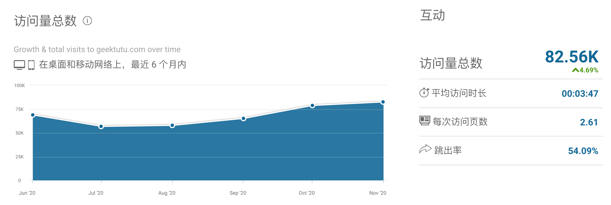

从 2020 年开始，在博客里记录每一年的成长与改变。

年初的时候，给自己定了两个目标：工作上升一级，博客浏览量能翻一倍。第一个目标没想到刚过完年，就实现了。第二个目标到年底的时候也基本达成了，月 UV 3w，月 PV 8w。

在这里，将过程中的一些经历和感悟记录下来。

## 工作

今年所做的工作需要横跨很多部门，而我是特别不愿意干这种事情的。喜欢一个人静下心来写代码，不被打扰。对其他部门的同事，特别是总来问你进展，顺便把成果包装的同事特别反感。但是在这个过程中，逐渐地转变了想法。一个人的能力是有限的，跨团队跨部门的合作更容易产生大的价值，关键点在于摘掉有色眼镜，找到大家共同的利益诉求，把事情做好。不要担心被别人包装，别人来包装你，说明你有价值。把蛋糕做大才是最重要的，一个大的蛋糕，再怎么分，也比原来手中的小蛋糕大。

今年涉及的工作是原来从来没接触过的，经过一年的摸爬滚打，竟然做得还不错。我在公司内部总结为那么一句话：

> 一年只做一件事，一年做好一件事。

我一直是一个很浮躁的人，坚持做一件事不超过三个月。Github 上的开源项目也是这样，经常发现过了几个月还没啥人关注，就放弃了。上面这句话，是今年的最大的感悟。不管是在工作中，还是在工作外。很多事，很可能需要持续到某一个时间点，才会产生质变，不要过早放弃，也不要随意切换方向。选择是有时间成本的。

## 博客

今年博客的阅读量和评论量主要是来自于这两个系列：

- [七天用 Go 从零实现系列](https://geektutu.com/post/gee.html)
- [Go 语言高性能编程](https://geektutu.com/post/high-performance-go.html)

七天系列 Github 有 5.9k 的星星，这是一个完全原创的项目，从很多童鞋的评论来看，能够对大部分童鞋理解一些优秀的开源项目和框架源码有帮助。

我分析过我的博客的流量构成，搜索、直接访问和引荐各占了三分之一。直接访问有那么高是比较意外的，我觉得对持续提升流量有帮助的几个点：

- 坚持写一个领域的文章，比如写 Go，就坚持写个几十篇，比较成体系，对搜索引擎比较友好，而且也容易在这个领域形成一定的影响力，会有很多直接访问的流量，因为别人记住你了。
- 不要在其他平台随意地转载自己的文章。大部分博客平台的权重很高，如果同时发在自己的独立博客和 CSDN、博客园这样的平台，那么很容易被搜索引擎判定抄袭，降低权重，博客的搜索流量会变得很小。如果想完全同步，建议间隔一个月。如果你的域名权重很高，就无所谓了。
- 可以在其他平台发一些汇总链接的文章，我的每个系列都会在知乎发汇总贴，比如 [7天用Go从零实现RPC框架GeeRPC](https://zhuanlan.zhihu.com/p/265813329)，有 200 个赞，一个原因是有童鞋在知乎关注了我，发篇文章能够让关注我的同学知道我出新的系列了。另一个原因，也是可以在一定程度上增加外链的数量，可以增加博客文章的权重。
- 检查下你的订阅文件，有没有包含全文。我原来没注意，生成的 atom2.xml 包含了全文，每次更新，第一时间被很多采集站全文搬运，这篇文章就白写了。利用标准的 feed 文件内容，直接发布，还不用写爬虫，不搬运你搬运谁呢，这种搬运更不可能注明转载和原文地址了。现在生成的 [feed.xml](https://geektutu.com/feed.xml) 去掉了正文。

## 读的书

今年纸质书读得比较少，微信读书读了挺多，在这里分享两本比较有意思的鸡汤书吧。

第一本书是《微习惯》，因为这本书，我给自己定了每天写 50 字和做 1 个俯卧撑的目标，坚持了很长时间。我的第二个系列能写那么快，我觉得这本书功不可没。养成一个习惯很难，即使有再强大的动机和毅力都很难坚持下来。那如果这个习惯只需要极其微小的动机，不消耗任何的毅力呢？比如每天一个俯卧撑，中午吃完饭大家午休的时候，你就趴下来，再站起来，一秒钟一个俯卧撑的目标达成，每天花费一秒钟，就养成了一个健身的好习惯。

我从第一天的 5 个，到现在每天中午做 40 个。但是目标仍旧是每天 1 个，哪天生病了，实在是没法动，随便做 1 个，这个习惯就还是没有断的。

每天写 50 字也是一样的，大部分时间，在手机或者电脑上随便敲 50 字就睡觉了，然后有三分之一的时间，敲满了 2 千字，比如今天这篇总结。假如没这个习惯，我估计明日复明日，这个年终总结就没了。

第二本书是《刻意练习》，这本书比较啰嗦。对我启发比较大的地方总结一下：

首先，只花时间练习是不够的，还得“刻意”，最佳方式是找这个领域你能接触到的最厉害的人给你辅导，给你反馈。一件事情简单的重复是无意义的，是浪费时间，一万小时也不会变成专家。自己自学是没问题的，但是如果有人指导你，那必然是能更快的。比如入门 Python，淘宝花 200 块，让别人给你讲 1 小时课，他的水平可能不高，但是对于从没有接触过 Python 的你，指导你安装好环境，写出 hello world 是足够了的。如果自己去琢磨，很可能折腾了一天，啥事都没做成。工作以后，时间是很宝贵的。

第二，一件事重复做一百次是有意义的，前提是每次做完思考下哪些地方可以提升。比如学英语，对大部分人来说，看一百部电影的效果比不上《老友记》的一集看一百遍。看一百部电影，光顾着看字幕去了，不太可能找到提升的点。而找一个难度适合的半小时的材料，听一百遍，每次多听懂一个单词，一句话，提升就是巨大的。

只有“刻意”去做，才不会看似忙碌，实则浪费时间。

## flag

唯一的 flag 就是，通过上述两本鸡汤书养成的习惯，明年不要丢。再小的习惯，坚持一年，也会产生巨大的能量。