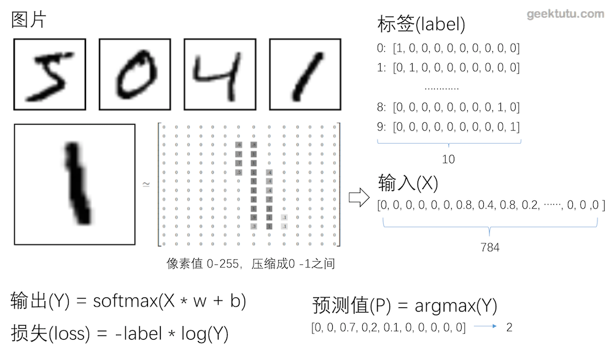
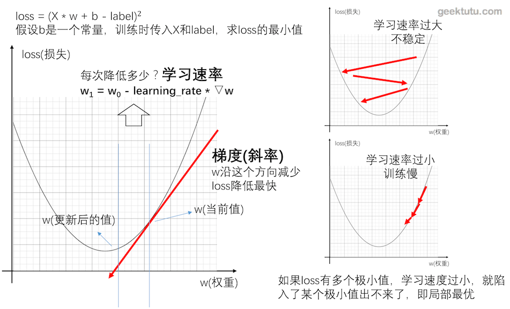

这篇文章是 **TensorFlow Tutorial** 入门教程的第一篇文章。主要介绍了如何从0开始用tensorflow搭建最简单的网络进行训练。

## mnist数据集

### 简介

MNIST是一个入门级的计算机视觉数据集，它包含各种手写数字图片。在机器学习中的地位相当于Python入门的打印`Hello World`。官网是[THE MNIST DATABASE of handwritten digits](http://yann.lecun.com/exdb/mnist/)
该数据集包含以下四个部分

- train-images-idx3-ubyte.gz: 训练集-图片，6w
- train-labels-idx1-ubyte.gz: 训练集-标签，6w
- t10k-images-idx3-ubyte.gz: 测试集-图片，1w
- t10k-labels-idx1-ubyte.gz: 测试集-标签，1w

### 图片和标签

mnist数据集里的每张图片大小为28 * 28像素，可以用28 * 28的大小的数组来表示一张图片。
标签用大小为10的数组来表示，这种编码我们称之为One hot（独热编码）。

### One-hot编码（独热编码）

独热编码使用N位代表N种状态，任意时候只有其中一位有效。

采用独热编码的例子

```
性别:  
[0, 1]代表女，[1, 0]代表男

数字0-9: 
[0,0,0,0,0,0,0,0,0,1]代表9，[0,1,0,0,0,0,0,0,0,0]代表1
```

独热编码的优点在于
- 能够处理非连续型数值特征
- 在一定程度上也扩充了特征。比如性别本身是一个特征，经过编码以后，就变成了男或女两个特征。

> 在神经网络中，独热编码其实具有很强的容错性，比如神经网络的输出结果是 [0,0.1,0.2,0.7,0,0,0,0,0, 0]转成独热编码后，表示数字3。即值最大的地方变为1，其余均为0。[0,0.1,0.4,0.5,0,0,0,0,0, 0]也能表示数字3。

> numpy中有一个函数，numpy.argmax()可以取得最大值的下标。

## 神经网络的重要概念
### 输入（x）输出（y）、标签（label）
- 输入是指传入给网络处理的向量，相当于数学函数中的变量。
- 输出是指网络处理后返回的结果，相当于数据函数中的函数值。
- 标签是指我们期望网络返回的结果。

对于识别mnist图片而言，输入是大小为784（28 * 28）的向量，输出是大小为10的概率向量（概率最大的位置，即预测的数字）。

### 损失函数（loss function）
损失函数评估网络模型的好坏，值越大，表示模型越差，值越小，表示模型越好。因为传入大量的训练集训练的目标，就是将损失函数的值降到最小。

常见的损失函数定义：
- 差的平方和 sum((y - label)^2)

```
[0, 0, 1] 与 [0.1, 0.3, 0.6]的差的平方和为 0.01 + 0.09 + 0.16 = 0.26
[0, 0, 1] 与 [0.2, 0.2, 0.6]的差的平方和为 0.04 + 0.04 + 0.16 = 0.24
[0, 0, 1] 与 [0.1, 0, 0.9]的差的平方和为 0.01 + 0.01 = 0.02
```
- 交叉熵 -sum(label * log(y))

```

[0, 0, 1] 与 [0.1, 0.3, 0.6]的交叉熵为 -log(0.6) = 0.51
[0, 0, 1] 与 [0.2, 0.2, 0.6]的交叉熵为 -log(0.6) = 0.51
[0, 0, 1] 与 [0.1, 0, 0.9]的交叉熵为 -log(0.9) = 0.10
```
当label为0时，交叉熵为0，label为1时，交叉熵为-log(y)，交叉熵只关注独热编码中有效位的损失。这样屏蔽了无效位值的变化（无效位的值的变化并不会影响最终结果），并且通过取对数放大了有效位的损失。当有效位的值趋近于0时，交叉熵趋近于正无穷大。



### 回归模型

我们可以将网络理解为一个函数，回归模型，其实是希望对这个函数进行拟合。
比如定义模型为 Y = X * w + b，对应的损失即

```
loss = (Y - labal)^2
     = -(X * w - b - label)^2
这里损失函数用方差计算，这个函数是关于w和b的二次函数，所以神经网络训练的目的是找到w和b，使得loss最小。
```

可以通过不断地传入X和label的值，来修正w和b，使得最终得到的Y与label的loss最小。这个训练的过程，可以采用**梯度下降**的方法。通过梯度下降，找到最快的方向，调整w和b值，使得w * X + b的值越来越接近label。
梯度下降的具体过程，就不在这篇文章中展开了。



### 学习速率
简单说，梯度即一个函数的斜率，找到函数的斜率，其实就知道了w和b的值往哪个方向调整，能够让函数值（loss）降低得最快。那么方向知道了，往这个方向调整多少呢？这个数，神经网络中称之为学习速率。学习速率调得太低，训练速度会很慢，学习速率调得过高，每次迭代波动会很大。

### softmax激活函数

本文不展开讲解softmax激活函数。事实上，再计算交叉熵前的Y值是经过softmax后的，经过softmax后的Y，并不影响Y向量的每个位置的值之间的大小关系。大致有2个作用，一是放大效果，二是梯度下降时需要一个可导的函数。

```python
def softmax(x):
    import numpy as np
    return np.exp(x) / np.sum(np.exp(x), axis=0)

softmax([4, 5, 10])
# [ 0.002,  0.007,  0.991]
```

## Tensorflow识别手写数字

### 构造网络 `model.py`

```python
import tensorflow as tf


class Network:
    def __init__(self):
        # 学习速率，一般在 0.00001 - 0.5 之间
        self.learning_rate = 0.001

        # 输入张量 28 * 28 = 784个像素的图片一维向量
        self.x = tf.placeholder(tf.float32, [None, 784])

        # 标签值，即图像对应的结果，如果对应数字是8，则对应label是 [0,0,0,0,0,0,0,0,1,0]
        # 这种方式称为 one-hot编码
        # 标签是一个长度为10的一维向量，值最大的下标即图片上写的数字
        self.label = tf.placeholder(tf.float32, [None, 10])

        # 权重，初始化全 0
        self.w = tf.Variable(tf.zeros([784, 10]))
        # 偏置 bias， 初始化全 0
        self.b = tf.Variable(tf.zeros([10]))
        # 输出 y = softmax(X * w + b)
        self.y = tf.nn.softmax(tf.matmul(self.x, self.w) + self.b)

        # 损失，即交叉熵，最常用的计算标签(label)与输出(y)之间差别的方法
        self.loss = -tf.reduce_sum(self.label * tf.log(self.y + 1e-10))

        # 反向传播，采用梯度下降的方法。调整w与b，使得损失(loss)最小
        # loss越小，那么计算出来的y值与 标签(label)值越接近，准确率越高
        self.train = tf.train.GradientDescentOptimizer(self.learning_rate).minimize(self.loss)

        # 以下代码验证正确率时使用
        # argmax 返回最大值的下标，最大值的下标即答案
        # 例如 [0,0,0,0.9,0,0.1,0,0,0,0] 代表数字3
        predict = tf.equal(tf.argmax(self.label, 1), tf.argmax(self.y, 1))

        # predict -> [true, true, true, false, false, true]
        # reduce_mean即求predict的平均数 即 正确个数 / 总数，即正确率
        self.accuracy = tf.reduce_mean(tf.cast(predict, "float"))
```

### 训练 `train.py`

```python
import tensorflow as tf
from tensorflow.examples.tutorials.mnist import input_data
from model import Network


class Train:
    def __init__(self):
        self.net = Network()

        # 初始化 session
        # Network() 只是构造了一张计算图，计算需要放到会话(session)中
        self.sess = tf.Session()
        # 初始化变量
        self.sess.run(tf.global_variables_initializer())

        # 读取训练和测试数据，这是tensorflow库自带的，不存在训练集会自动下载
        # 项目目录下已经下载好，删掉后，重新运行代码会自动下载
        # data_set/train-images-idx3-ubyte.gz
        # data_set/train-labels-idx1-ubyte.gz
        # data_set/t10k-images-idx3-ubyte.gz
        # data_set/t10k-labels-idx1-ubyte.gz
        self.data = input_data.read_data_sets('../data_set', one_hot=True)

    def train(self):
        # batch_size 是指每次迭代训练，传入训练的图片张数。
        # 数据集小，可以使用全数据集，数据大的情况下，
        # 为了提高训练速度，用随机抽取的n张图片来训练，效果与全数据集相近
        # https://www.zhihu.com/question/32673260
        batch_size = 64

        # 总的训练次数
        train_step = 2000

        # 开始训练
        for i in range(train_step):
            # 从数据集中获取 输入和标签(也就是答案)
            x, label = self.data.train.next_batch(batch_size)
            # 每次计算train，更新整个网络
            # loss只是为了看到损失的大小，方便打印
            _, loss = self.sess.run([self.net.train, self.net.loss],
                                    feed_dict={self.net.x: x, self.net.label: label})

            # 打印 loss，训练过程中将会看到，loss有变小的趋势
            # 代表随着训练的进行，网络识别图像的能力提高
            # 但是由于网络规模较小，后期没有明显下降，而是有明显波动
            if (i + 1) % 10 == 0:
                print('第%5d步，当前loss：%.2f' % (i + 1, loss))
```

### 验证准确率 `train.py`

```python
class Train:
    def __init__(self):
        ...

    def train(self):
        ...

    def calculate_accuracy(self):
        test_x = self.data.test.images
        test_label = self.data.test.labels
        # 注意：与训练不同的是，并没有计算 self.net.train
        # 只计算了accuracy这个张量，所以不会更新网络
        # 最终准确率约为0.91
        accuracy = self.sess.run(self.net.accuracy,
                                 feed_dict={self.net.x: test_x, self.net.label: test_label})
        print("准确率: %.2f，共测试了%d张图片 " % (accuracy, len(test_label)))
```

### 主函数 `train.py`

```python
if __name__ == "__main__":
    app = Train()
    app.train()
    app.calculate_accuracy()

# 运行后，会打印出如下结果
# 第   10步，当前loss：120.93
# 第   20步，当前loss：90.38
# 第   30步，当前loss：80.88
# 第   40步，当前loss：71.23
# 第   50步，当前loss：66.07
# 第   60步，当前loss：55.83
# 第   70步，当前loss：47.27
# 第   80步，当前loss：45.42
# 第   90步，当前loss：37.14
#     ...
# 第 2000步，当前loss：21.75
# 准确率: 0.91，共测试了10000张图片 
```

> 项目已更新在[Github](https://github.com/geektutu/tensorflow-tutorial-samples)，数据集由于国内网络等因素，有时候不能正确下载，所以数据集也一并同步了。

**觉得还不错，不要吝惜你的[star](https://github.com/geektutu/tensorflow-tutorial-samples)，支持是持续不断更新的动力。**

## 附 推荐

- [一篇文章入门 Python](https://geektutu.com/post/quick-python.html)