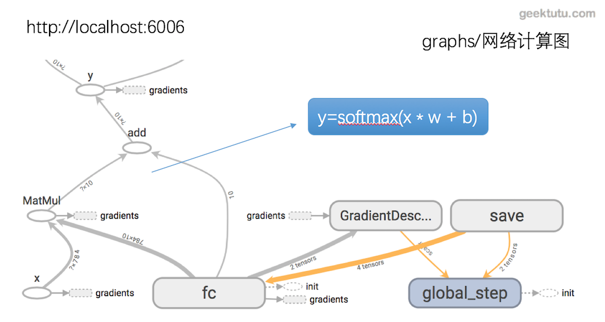
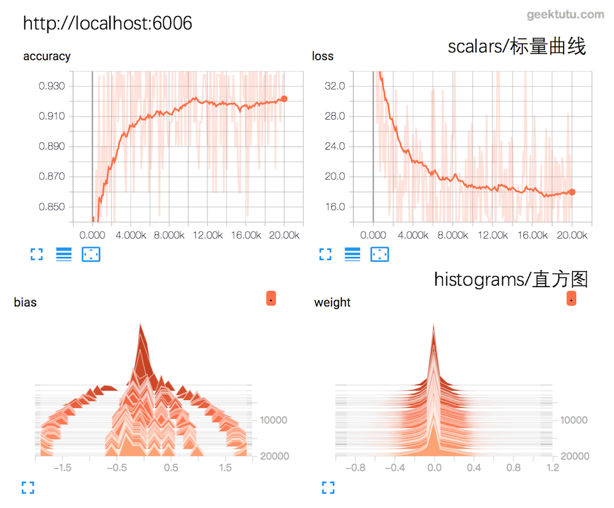

这篇文章是 **TensorFlow Tutorial** 入门教程的第三篇文章。

在第一篇文章中，我们通过每10步打印出loss值的方式，来观察loss值的变化。但是这样做并不直观，有没有什么方式能够让整个训练的过程更加一目了然呢？tensorflow提供了tensorboard，专门来实现训练过程的可视化。

## tensorboard

为了更方便 tensorflow 程序的理解、调试与优化，Google发布了一套叫做 tensorboard 的可视化工具。我们可以用 tensorboard 来展现tensorflow 图像，绘制图像生成的定量指标图以及附加数据。

tensorboard 是通过读取 tensorflow 的`事件文件`来运行的，因为，我们需要将可视化的数据写入事件文件，这个过程称为`Summary`即汇总数据，这样才能在tensorflow中看到期望的可视化效果，先展示下最终的效果。

- **网络结构图**



- **accuray与loss，bias与weight**



## summary的生命周期 

**1. 选择需要汇总数据的张量**

```python
# 例如在识别 mnist 的网络中
w = tf.Variable(tf.zeros([784, 10]), name="fc/weight")
loss = -tf.reduce_sum(label * tf.log(y + 1e-10))
# 创建loss的summary node，scalar表示最后的数据会展示为标量曲线。
tf.summary.scalar('loss', loss)
# 创建w的summary node， 最后展示为直方图
tf.summary.histogram('weight', w)
```

**2. 汇总数据的存放位置**

```python
# 存放在当前目录下的 log 文件夹中，获得文件句柄
merged_writer = tf.summary.FileWriter("./log", sess.graph)
```

**3. 生成汇总数据**

> 在tensorflow中，所有的操作只有当你执行，或者另一个操作依赖于它的输出时才会运行。我们刚才创建的这些summary node没有任何操作依赖于它们的结果，因此是不会主动生成的汇总数据的。为了生成汇总信息，可以使用tf.merge_all_summaries来合并所有的summary node。

```python
# 合并所有的summary node
merged_summary_op = tf.summary.merge_all()
# 训练时一起run
_, loss, merged_summary = self.sess.run([train, loss, merged_summary_op], feed_dict={x: x, label: label})
```

**4. 保存汇总数据到文件中**

> 可以每一步数据都保存，但是一般没有这个必要，可以选择每100步保存一次。

```python
if step % 100 == 0:
  merged_writer.add_summary(merged_summary, step)
```

## 可视化mnist网络

- **在模型（model.py）中选择需要summary的张量**

```python
import tensorflow as tf


class Network:
    def __init__(self):
        self.learning_rate = 0.001
        self.global_step = tf.Variable(0, trainable=False, name="global_step")

        self.x = tf.placeholder(tf.float32, [None, 784], name="x")
        self.label = tf.placeholder(tf.float32, [None, 10], name="label")

        self.w = tf.Variable(tf.zeros([784, 10]), name="fc/weight")
        self.b = tf.Variable(tf.zeros([10]), name="fc/bias")
        self.y = tf.nn.softmax(tf.matmul(self.x, self.w) + self.b, name="y")

        self.loss = -tf.reduce_sum(self.label * tf.log(self.y + 1e-10))
        self.train = tf.train.GradientDescentOptimizer(self.learning_rate).minimize(
            self.loss, global_step=self.global_step)

        predict = tf.equal(tf.argmax(self.label, 1), tf.argmax(self.y, 1))
        self.accuracy = tf.reduce_mean(tf.cast(predict, "float"))

        # 创建 summary node
        # w, b 画直方图
        # loss, accuracy画标量图
        tf.summary.histogram('weight', self.w)
        tf.summary.histogram('bias', self.b)
        tf.summary.scalar('loss', self.loss)
        tf.summary.scalar('accuracy', self.accuracy)
```

- **训练时保存summary的数据**

```python
import tensorflow as tf
from tensorflow.examples.tutorials.mnist import input_data
from model import Network

CKPT_DIR = 'ckpt'

class Train:
    def __init__(self):
        self.net = Network()
        self.sess = tf.Session()
        self.sess.run(tf.global_variables_initializer())
        self.data = input_data.read_data_sets('../data_set', one_hot=True)

    def train(self):
        batch_size = 64
        train_step = 20000
        step = 0
        save_interval = 1000
        saver = tf.train.Saver(max_to_keep=5)

        # merge所有的summary node
        merged_summary_op = tf.summary.merge_all()
        # 可视化存储目录为当前文件夹下的 log
        merged_writer = tf.summary.FileWriter("./log", self.sess.graph)

        ckpt = tf.train.get_checkpoint_state(CKPT_DIR)
        if ckpt and ckpt.model_checkpoint_path:
            saver.restore(self.sess, ckpt.model_checkpoint_path)
            # 读取网络中的global_step的值，即当前已经训练的次数
            step = self.sess.run(self.net.global_step)
            print('Continue from')
            print('        -> Minibatch update : ', step)

        while step < train_step:
            x, label = self.data.train.next_batch(batch_size)
            _, loss, merged_summary = self.sess.run(
                [self.net.train, self.net.loss, merged_summary_op],
                feed_dict={self.net.x: x, self.net.label: label}
            )
            step = self.sess.run(self.net.global_step)

            if step % 100 == 0:
                merged_writer.add_summary(merged_summary, step)

            if step % save_interval == 0:
                saver.save(self.sess, CKPT_DIR + '/model', global_step=step)
                print('%s/model-%d saved' % (CKPT_DIR, step))

app = Train()
app.train()
```

## 启动tensorboard

启动前，需要先训练网络，训练过程中，数据会每隔100步写入log文件夹下的文件中，这个时候，可以启动tensorboard（随tensorflow安装，不用单独安装）

```shell
tensorboard --logdir=./log
或
python -m tensorboard.main --logdir=./log
```

`./log`是summary数据存储的路径，即在tf.summary.FileWriter中传入的路径。tensorboard 开始运行后，在浏览器中输入 `localhost:6006` 即可看到本文最开始的效果。

**觉得还不错，不要吝惜你的[star](https://github.com/geektutu/tensorflow-tutorial-samples)，支持是持续不断更新的动力。**

## 附 推荐

- [一篇文章入门 Python](https://geektutu.com/post/quick-python.html)