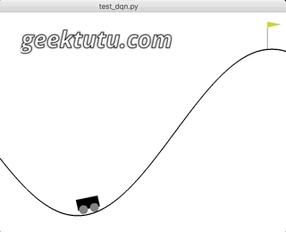
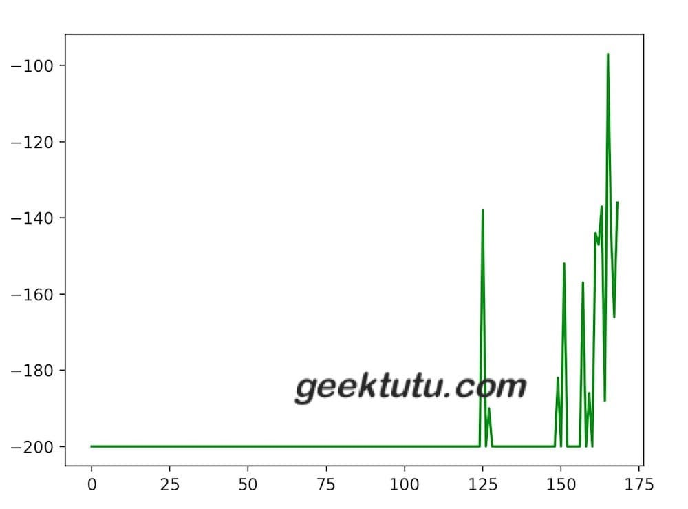

<style>
@media (min-width: 992px) {.gkt-article-start + p > img {min-height: 15rem;}}
.gkt-article-start + p > img {width: auto;}
</style>

这篇文章是 **TensorFlow 2.0 Tutorial** 入门教程的第八篇文章。

实现DQN(Deep Q-Learning Network)算法，**代码90行**

## MountainCar 简介

上一篇文章[TensorFlow 2.0 (七) - 强化学习 Q-Learning 玩转 OpenAI gym](https://geektutu.com/post/tensorflow2-gym-q-learning.html)介绍了如何用**Q表(Q-Table)**，来更新策略，使小车顺利达到山顶，整个代码只有50行。我们先回顾一下上一篇文章的要点。

1. **MountainCar-v0 的游戏目标**

向左/向右推动小车，小车若到达山顶，则游戏胜利，若200回合后，没有到达山顶，则游戏失败。每走一步得-1分，最低分-200，越早到达山顶，则分数越高。

2. **MountainCar-v0 的几个重要的变量**

- State: [position, velocity]，position 范围 [-0.6, 0.6]，velocity 范围 [-0.1, 0.1]
- Action: 0(向左推) 或 1(不动) 或 2(向右推)
- Reward: -1
- Done: 小车到达山顶或已花费200回合


3. **Q-Table 的更新方程**

> Q[s][a] = (1 - lr) * Q[s][a] + lr * (reward + factor * max(Q[next_s]))

## 神经网络替换 Q-Table

这一篇文章，我们将借助`TensorFlow 2.0`中的`keras`库，搭建深度神经网络(Deep Netural Network, DNN)，替代`Q-Table`，即**深度Q网络(Deep Q-Learning Network, DQN)**，实现Q值的计算。

我们将神经网络比作一个函数，神经网络代替`Q-Table`其实就是在做 **函数拟合**，也可以称为**值函数近似(Value Function Approximation)**。

维基百科上有一个**万能近似定理(Universal approximation theorem)**，[Universal approximation theorem](https://en.wikipedia.org/wiki/Universal_approximation_theorem)定理表明：前馈神经网络，只需具备单层隐含层和有限个神经单元，就能以任意精度拟合任意复杂度的函数。

这是我们上篇文章定义的`Q-Table`

```python
Q = defaultdict(lambda: [0, 0, 0])
```

- 输入(key): 一维向量，(position, velocity)
- 输出(value)：一维向量，(action0_value, action1_value, action2_value)


接下来那我们按照定义的输入输出，简单搭一个神经网络吧。

```python
# dqn.py
# https://geektutu.com
from collections import deque
import random
import gym
import numpy as np
from tensorflow.keras import models, layers, optimizers

class DQN(object):
    def __init__(self):
        self.step = 0
        self.update_freq = 200  # 模型更新频率
        self.replay_size = 2000  # 训练集大小
        self.replay_queue = deque(maxlen=self.replay_size)
        self.model = self.create_model()
        self.target_model = self.create_model()

    def create_model(self):
        """创建一个隐藏层为100的神经网络"""
        STATE_DIM, ACTION_DIM = 2, 3
        model = models.Sequential([
            layers.Dense(100, input_dim=STATE_DIM, activation='relu'),
            layers.Dense(ACTION_DIM, activation="linear")
        ])
        model.compile(loss='mean_squared_error',
                      optimizer=optimizers.Adam(0.001))
        return model
    
    def act(self, s, epsilon=0.1):
        """预测动作"""
        # 刚开始时，加一点随机成分，产生更多的状态
        if np.random.uniform() < epsilon - self.step * 0.0002:
            return np.random.choice([0, 1, 2])
        return np.argmax(self.model.predict(np.array([s]))[0])

    def save_model(self, file_path='MountainCar-v0-dqn.h5'):
        print('model saved')
        self.model.save(file_path)
```

网络结构很简单，只有一层隐藏层的全连接网络(Full Connected Network, FC)。但是我们用这个网络结构生成了2个model，一个是**预测**使用的`model`，另一个是训练时使用的`target_model`。看完下面的代码，就容易理解了。

```python
# dqn.py
# https://geektutu.com
class DQN(object):
    # 省略 __init__, create_model, act, save_model，见上。
    def remember(self, s, a, next_s, reward):
        """历史记录，position >= 0.4时给额外的reward，快速收敛"""
        if next_s[0] >= 0.4:
            reward += 1
        self.replay_queue.append((s, a, next_s, reward))

    def train(self, batch_size=64, lr=1, factor=0.95):
        if len(self.replay_queue) < self.replay_size:
            return
        self.step += 1
        # 每 update_freq 步，将 model 的权重赋值给 target_model
        if self.step % self.update_freq == 0:
            self.target_model.set_weights(self.model.get_weights())

        replay_batch = random.sample(self.replay_queue, batch_size)
        s_batch = np.array([replay[0] for replay in replay_batch])
        next_s_batch = np.array([replay[2] for replay in replay_batch])

        Q = self.model.predict(s_batch)
        Q_next = self.target_model.predict(next_s_batch)

        # 使用公式更新训练集中的Q值
        for i, replay in enumerate(replay_batch):
            _, a, _, reward = replay
            Q[i][a] = (1 - lr) * Q[i][a] + lr * (reward + factor * np.amax(Q_next[i]))
        
        # 传入网络进行训练
        self.model.fit(s_batch, Q, verbose=0)
```

整个结构如下图所示：


我们需要用到上文提到的更新方程，来构造训练数据。其中`Q_next`是对`next_s`的预测值，在这里其实也可以使用`model`，但是`model`变化得太过频繁，而且我们在训练时，是以**batch**为单位进行训练的，也就是说很多训练数据对应的是之前状态的model，而不是频繁更新值的`model`，因此，我们使用更新频率低的`target_model`来计算`next_s`的Q值。

同时使用2个Q-Network的算法被称为**双Q网络(Double DQN, DDQN)**。因为传统的DQN普遍会过高估计Action的Q值，误差会随着Action的增加而增加，可能导致某个次优的值超过了最优Action的Q值，永远无法找到最优解。`DDQN`能够有效地解决这个问题。DQN 在比较简单的游戏，比如**CartPole-v0**能够取得较好的效果，但在**MountainCar-v0**这个游戏中，如果只使用 DQN 很难找到最优解。

`target_model`每训练update_freq(200)次，更新权重与`model`一致。

那为什么在`Q-Table`中，可以用单步的数据来进行更新，但换作了神经网络，就需要以**batch**为单位来进行训练呢？这个问题在知乎有过讨论，链接在这里：[深度学习中的batch的大小对学习效果有何影响？](https://www.zhihu.com/question/32673260)，简单说，如果单步训练，即**batch**为1，每次朝着单步的梯度方向修正，横冲直撞各自为政，难以收敛。如果**batch**过大，容易过拟合。而且`DQN`是增强学习算法，前面的训练数据质量较差，随着训练的进行，产生的动作价值越来越高，增强学习更为看重后面的训练数据，所以**batch**也不宜过大。

而这一点，也是`replay_queue`的最大容量设置为**2000**的原因。队列有先进先出的特性，当后面的数据加进来后，如果数据条数超过2000，前面的数据就会从队列中移除。后面的训练数据对于强化学习更重要。

## 可改动的 Reward

代码中还有这么一个细节：

```python
if next_s[0] >= 0.4:
    reward += 1
```

`MountainCar-v0`这个游戏中，`State`由2个值构成，(position, velocity)。山顶的位置是**0.5**，因此当**position**大于**0.4**时，给`Reward`额外加**1**。这么做，是希望加快神经网络的收敛，更快地达到预期结果。每一步的`Reward`其实都是可以调整的，怎么做会让训练效果更好，可以动动脑，尝试尝试。

## 提前终止的 DQN 训练

好，神经网络已经准备就绪，接下来就开始训练吧。

```python
# dqn.py
# https://geektutu.com
env = gym.make('MountainCar-v0')
episodes = 1000  # 训练1000次
score_list = []  # 记录所有分数
agent = DQN()
for i in range(episodes):
    s = env.reset()
    score = 0
    while True:
        a = agent.act(s)
        next_s, reward, done, _ = env.step(a)
        agent.remember(s, a, next_s, reward)
        agent.train()
        score += reward
        s = next_s
        if done:
            score_list.append(score)
            print('episode:', i, 'score:', score, 'max:', max(score_list))
            break
    # 最后10次的平均分大于 -160 时，停止并保存模型
    if np.mean(score_list[-10:]) > -160:
        agent.save_model()
        break
env.close()
```

如果看过[TensorFlow 2.0 (六) - 监督学习玩转 OpenAI gym game](https://geektutu.com/post/tensorflow2-gym-nn.html)和[TensorFlow 2.0 (七) - 强化学习 Q-Learning 玩转 OpenAI gym](https://geektutu.com/post/tensorflow2-gym-q-learning.html)这两篇文章的话，这部分代码就非常简单了。

我们在训练过程中，记录了每一次游戏的分数。并且，如果最近10次的平均分高于**-160**时，结束训练，并保存模型。

运行一下，看看效果吧。

```bash
$ python dqn.py
episode: 0 score: -200.0 max: -200.0
episode: 1 score: -200.0 max: -200.0
episode: 2 score: -200.0 max: -200.0
...
episode: 124 score: -200.0 max: -200.0
episode: 125 score: -138.0 max: -138.0
...
episode: 166 score: -144.0 max: -97.0
episode: 167 score: -166.0 max: -97.0
episode: 168 score: -136.0 max: -97.0
model saved
```

可以看到，在第**125次**时，首次成功爬到了山顶，在**168次**的时候，平均分达到预期，停止了训练。

## 训练效果绘图

接下来，我们添加3行代码，将整个训练过程中的`score_list`的变化情况画出来，直观感受强化学习的学习过程。

```python
import matplotlib.pyplot as plt

plt.plot(score_list, color='green')
plt.show()
```



## 模型预测/测试

和之前一样，准备了一个非常简单的可视化的测试代码，直观地感受下最终的游戏效果。

```python
# test_dqn.py
# https://geektutu.com
import time
import gym
import numpy as np
from tensorflow.keras import models
env = gym.make('MountainCar-v0')
model = models.load_model('MountainCar-v0-dqn.h5')
s = env.reset()
score = 0
while True:
    env.render()
    time.sleep(0.01)
    a = np.argmax(model.predict(np.array([s]))[0])
    s, reward, done, _ = env.step(a)
    score += reward
    if done:
        print('score:', score)
        break
env.close()
```

运行一下，还不错~

```bash
$ python test_dqn.py
score: -161.0
```


代码已经上传到[Github - tensorflow-tutorial-samples](https://github.com/geektutu/tensorflow-tutorial-samples/tree/master/gym/MountainCar-v0-dqn)，**dqn.py**只有90行，不妨试一试吧~

## 附 推荐

- [一篇文章入门 Python](https://geektutu.com/post/quick-python.html)
