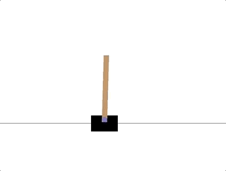

<style>
@media (min-width: 992px) {.gkt-article-start + p > img {min-height: 15rem;}}
.gkt-article-start + p > img {width: auto;}
</style>

这篇文章是 **TensorFlow 2.0 Tutorial** 入门教程的第六篇文章，介绍如何使用 **TensorFlow 2.0** 搭建神经网络(Neural Network, NN)，使用纯监督学习(Supervised Learning)的方法，玩转 OpenAI gym game。示例代码基于 Python 3 和 TensorFlow 2.0 。

[OpenAI gym](https://gym.openai.com/)是一个开源的游戏模拟环境，主要用来开发和比较强化学习(Reinforcement Learning, RL)的算法。这篇文章是 Tensorflow 2.0 系列使用 gym 的第一篇文章，网上介绍强化学习玩 gym 的文章比较多，而纯监督学习的文章极少。我们先使用纯监督学习的算法，一起感受 gym 的魅力吧。

## 如何安装

```bash
pip install tensorflow==2.0.0-beta0
pip install gym
# 如果你有多个Python环境，需要指定
# python3 -m pip install tensorflow==2.0.0-beta0
# python3 -m pip install gym
```

## OpenAI gym 初尝试

我们先对 OpenAI 的 gym 库的几个核心概念作个简单介绍。

想象一下你在玩贪吃蛇，你需要分析当前游戏的`状态(State)`，例如你所处的位置，周围的障碍物等，才能够决定下一步的`动作(Action)`，上下左右。那你每走一步，就会得到一个`奖励(Reward)`。这个奖励可能是正向奖励(Positive Reward)，也可能是负向奖励(Negative Reward)，比如撞到了障碍物。重复N次这样的过程，直到游戏`结束(Done)`。

从整个例子中，可以总结出几个重要的概念，接下来的示例将会使用 OpenAI gym 库提供的 **CartPole Game** 环境，一起来熟悉CartPole 游戏中的这几个概念的含义吧。先直接给一个可以运行看效果的示例，这个示例中，Action 是随机选择的。

```python
# try_gym.py
# https://geektutu.com
import gym  # 0.12.5
import random
import time

env = gym.make("CartPole-v0")  # 加载游戏环境

state = env.reset()
score = 0
while True:
    time.sleep(0.1)
    env.render()   # 显示画面
    action = random.randint(0, 1)  # 随机选择一个动作 0 或 1
    state, reward, done, _ = env.step(action)  # 执行这个动作
    score += reward     # 每回合的得分
    if done:       # 游戏结束
        print('score: ', score)  # 打印分数
        break
env.close()
```

```bash
$ python3 try_gym.py
score:  14.0
```

| 概念   | 解释                                                  | 示例                         |
| ----- | -------------------------------------------------- | ---------------------------- |
| State  | list：状态，[车位置, 车速度, 杆角度, 杆速度] | 0.02,0.95,-0.07,-1.53|
| Action | int：动作(0向左/1向右)                           | 1   |
| Reward | float：奖励(每走一步得1分)                        | 1.0 |
| Done   | bool：是否结束(True/False)，上限200回合           | False |

游戏上限是200回合，但是如果是随机选择 Action，就只得了14分，游戏就结束了。

## 搭建神经网络

我们的目的就是将随机选择 Action 的部分，变为由神经网络模型来选择。神经网络的输入是`State`，输出是`Action`。在这里，Action 用独热编码来表示，即 **[1, 0]** 表示向左，**[0, 1]** 表示向右。这样我们可以方便地使用`np.argmax()`获取预测的 Action 的值。

```python
np.argmax([0.3, 0.7]) # 1，假如神经网络的输出是 [0.3, 0.7]，那Action值为1，表示向右。
np.argmax([0.8, 0.2]) # 0，表示向右。
```

接下来我们搭建一个 `4 x 64 x 20 x 2` 的网络，输入层为4，输出层为2。

```python
# train.py
# https://geektutu.com
import random
import gym
import numpy as np
from tensorflow.keras import models, layers

env = gym.make("CartPole-v0")  # 加载游戏环境

STATE_DIM, ACTION_DIM = 4, 2  # State 维度 4, Action 维度 2
model = models.Sequential([
    layers.Dense(64, input_dim=STATE_DIM, activation='relu'),
    layers.Dense(20, activation='relu'),
    layers.Dense(ACTION_DIM, activation='linear')
])
model.summary()  # 打印神经网络信息
```

## 训练数据从哪里来？

神经网络的模型搭好了，那训练数据呢？

随机产生的数据，得分很低，如果不过滤，数据集质量是很低的。

最终的办法：**试，一百次不行，就试一万次**。

简而言之，我们在过程中计算`Score`，如果最终得分达到设定的标准，这个分数所对应的所有`State`和`Action`就可以作为我们的训练数据了。

```python
# train.py
def generate_data_one_episode():
    '''生成单次游戏的训练数据'''
    x, y, score = [], [], 0
    state = env.reset()
    while True:
        action = random.randrange(0, 2)
        x.append(state)
        y.append([1, 0] if action == 0 else [0, 1]) # 记录数据
        state, reward, done, _ = env.step(action) # 执行动作
        score += reward
        if done:
            break
    return x, y, score

def generate_training_data(expected_score=100):
    '''# 生成N次游戏的训练数据，并进行筛选，选择 > 100 的数据作为训练集'''
    data_X, data_Y, scores = [], [], []
    for i in range(10000):
        x, y, score = generate_data_one_episode()
        if score > expected_score:
            data_X += x
            data_Y += y
            scores.append(score)
    print('dataset size: {}, max score: {}'.format(len(data_X), max(scores)))
    return np.array(data_X), np.array(data_Y)
```

这样，我们就可以使用`generate_training_data`函数生成训练集了。

## 训练并保存模型

神经网络和数据集都准备好了，训练就非常简单了。

```python
# train.py
data_X, data_Y = generate_training_data()
model.compile(loss='mse', optimizer='adam', epochs=5)
model.fit(data_X, data_Y)
model.save('CartPole-v0-nn.h5')  # 保存模型
```

从运行的结果看，我们最终得到的训练集大小为213，最大分数是108分。

```bash
$ python train.py
Model: "sequential"
_________________________________________________________________
Layer (type)                 Output Shape              Param #   
=================================================================
dense (Dense)                (None, 64)                320       
_________________________________________________________________
dense_1 (Dense)              (None, 20)                1300      
_________________________________________________________________
dense_2 (Dense)              (None, 2)                 42        
=================================================================
Total params: 1,662
Trainable params: 1,662
Non-trainable params: 0
_________________________________________________________________
dataset size: 213, max score: 108.0
Train on 213 samples
Epoch 1/5
213/213 [==============================] - 0s 713us/sample - loss: 0.4701
Epoch 2/5
213/213 [==============================] - 0s 35us/sample - loss: 0.3920
Epoch 3/5
213/213 [==============================] - 0s 38us/sample - loss: 0.3370
Epoch 4/5
213/213 [==============================] - 0s 39us/sample - loss: 0.2985
Epoch 5/5
213/213 [==============================] - 0s 38us/sample - loss: 0.2745
```

## 模型测试/预测

```python
# predict.py
# https://geektutu.com
import time
import numpy as np
import gym
from tensorflow.keras import models


saved_model = models.load_model('CartPole-v0-nn.h5')  # 加载模型
env = gym.make("CartPole-v0")  # 加载游戏环境

for i in range(5):
    state = env.reset()
    score = 0
    while True:
        time.sleep(0.01)
        env.render()   # 显示画面
        action = np.argmax(saved_model.predict(np.array([state]))[0])  # 预测动作
        state, reward, done, _ = env.step(action)  # 执行这个动作
        score += reward     # 每回合的得分
        if done:       # 游戏结束
            print('using nn, score: ', score)  # 打印分数
            break
env.close()
```

```bash
$ python predict.py
using nn, score:  200.0
using nn, score:  200.0
using nn, score:  200.0
using nn, score:  200.0
using nn, score:  200.0
```

模型的结果很不错，每一次都达到了200的满分。

看看效果吧~


在[Github - tensorflow-tutorial-samples](https://github.com/geektutu/tensorflow-tutorial-samples/tree/master/gym/CartPole-v0-nn)上提供了`.py`和`.ipynb`2种格式的代码。

## 附 推荐

- [一篇文章入门 Python](https://geektutu.com/post/quick-python.html)