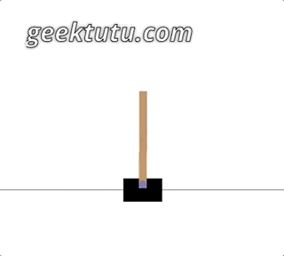
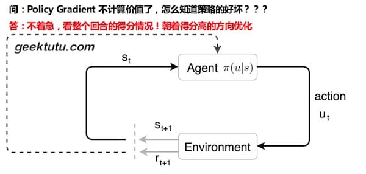
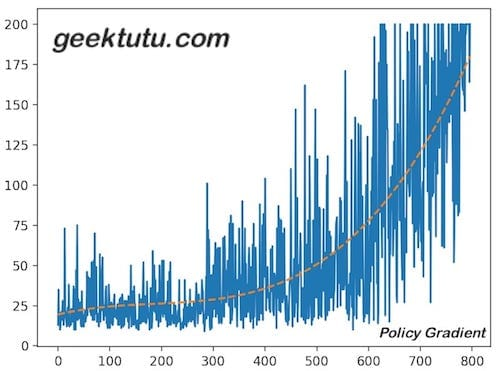

<style>
@media (min-width: 992px) {.gkt-article-start + p > img {min-height: 15rem;}}
.gkt-article-start + p > img {width: auto;}
</style>

这篇文章是 **TensorFlow 2.0 Tutorial** 入门教程的第九篇文章。

实战策略梯度算法(Policy Gradient)，**代码70行**

## CartPole 简介

在之前的文章中，我们使用过纯监督学习的算法，强化学习算法中的Q学习(Q-Learning)和深度Q网络(Deep Q-learning Network, DQN)，这一篇文章，我们选择策略梯度算法(Policy Gradient)，来玩一玩 CartPole。

先回顾一下**CartPole-v0**的几个重要概念。

| 概念   | 解释  | 示例  |
| ----- | -------------------------------| -------------|
| State  | 状态，[车位置, 车速度, 杆角度, 杆速度] | 0.02, 0.95, -0.07, -1.53|
| Action | 动作(0向左/1向右) | 1   |
| Reward | 奖励(每走一步得1分) | 1.0 |

我们在 [TensorFlow 2.0 (八) - 强化学习 DQN 玩转 gym Mountain Car](https://geektutu.com/post/tensorflow2-gym-dqn.html)这篇文章中，介绍了基于价值(value-based)的强化学习算法 DQN，在 DQN 中，神经网络的输入是状态，输出是每一个动作的价值。每一次从所有可行的动作中选择Q值最大的执行。我们使用了一个公式来不断地计算期望的Q值，训练神经网络。

那有没有可能，直接输出动作呢？这就是我们今天要介绍的基于策略(policy-based)的策略梯度算法(Policy Gradient)。

本文不涉及数学推导，仅介绍如何高效实现。如对该算法该兴趣，推荐 `Medium` 上有3.8k点赞的一篇文章[An introduction to Policy Gradients](https://medium.com/free-code-camp/an-introduction-to-policy-gradients-with-cartpole-and-doom-495b5ef2207f)。

## 搭建神经网络

Policy Gradient 网络的输入也是状态(State)，那输出呢？每个动作的概率。例如 `[0.7, 0.3]` ，这意味着有70%的几率会选择动作0，30%的几率选择动作1。相对于 Policy Gradient，DQN 的动作更确定，因为 DQN 每次总是选择Q值最大的动作，而Policy Gradient 按照概率选择，会产生更多的不确定性。

废话不多说，神经网络先搭起来吧~

```python
# policy_gradient.py
# https://geektutu.com
import matplotlib.pyplot as plt
import gym
import numpy as np
from tensorflow.keras import models, layers, optimizers

env = gym.make('CartPole-v0')

STATE_DIM, ACTION_DIM = 4, 2
model = models.Sequential([
    layers.Dense(100, input_dim=STATE_DIM, activation='relu'),
    layers.Dropout(0.1),
    layers.Dense(ACTION_DIM, activation="softmax")
])
model.compile(loss='mean_squared_error',
              optimizer=optimizers.Adam(0.001))
```

我们的神经网络很简单，输入层为4，输出层为2，隐藏层为100。不过这次代码多了一个`Dropout`，Dropout(0.1) 的含义是，随机忘记10%的权重。学习初期，一开始的数据质量不高，随着学习的进行，质量才逐步高了起来，一开始容易陷入**局部最优**和**过拟合**，使用 Dropout 可以有效避免。

如何选择动作呢？前文已经介绍，按照概率。

```python
# policy_gradient.py
# https://geektutu.com
def choose_action(s):
    """预测动作"""
    prob = model.predict(np.array([s]))[0]
    return np.random.choice(len(prob), p=prob)
```

## 优化策略

接下来是最大的问题，如何优化策略呢？



### 1) 衰减的累加期望

我们先想象一下，假如你在玩坦克大战，你的每一步都会对后面的局势产生巨大的影响。比如，敌方攻打你的老巢，你是选择先消灭敌方呢，还是选择坐视不理？很可能一步就决定了结局。因此，需要从整个回合的角度看待这个问题。先引入一个概念 `带衰减reward的累加期望` 。

> discount_reward[i] = reward[i] + gamma * discount_reward[i+1]

某一步的累加期望等于下一步的累加期望乘衰减系数`gamma`，加上`reward`。

手工算一算。

```
最后一步：1
倒数第二步：1 + 0.95 * 1 = 1.95
倒数第三步：1 + 0.95 * 1.95 = 2.8525
倒数第四步：1 + 0.95 * 2.8525 = 3.709875
```

假设某个回合只得了10分，那么这个回合的每一步的累加期望都不会高。假设得到了满分200分，那么回合中的大部分步骤的累加期望很会很高，越是前面的步骤，累加期望越高。

代码实现就很简单了，唯一的不同是最后加了中心化和标准化的处理。这样处理的目的是希望得到相同尺度的数据，避免因为数值相差过大而导致网络无法收敛。

```python
# policy_gradient.py
# https://geektutu.com
def discount_rewards(rewards, gamma=0.95):
    """计算衰减reward的累加期望，并中心化和标准化处理"""
    prior = 0
    out = np.zeros_like(rewards)
    for i in reversed(range(len(rewards))):
        prior = prior * gamma + rewards[i]
        out[i] = prior
    return out / np.std(out - np.mean(out))
```

### 2) 给loss加权重

一个动作的`累加期望`很高，自然希望该动作出现的概率变大，这就是学习的目的。一般，我们通过构造**标签(y_true/label)**，来训练神经网络。就如在[TensorFlow 2.0 (六) - 监督学习玩转 OpenAI gym game](https://geektutu.com/post/tensorflow2-gym-nn.html)这篇文章中做的一样。当然，我们还可以通过改变**损失函数(loss function)**达到目的。对于累加期望大的动作，可以放大`loss`的值，而对于累加期望小的动作，那么就减小loss的值。这样呢？神经网络就能快速朝着累加期望大的方向优化了。最简单的方法，给`loss`加一个权重。

所以我们的最终的损失函数就变成了：

> loss = discount_reward * loss

这里的`discount_reward`可以理解为策略梯度算法(Policy Gradient)中的梯度(Gradient)。如果对梯度不熟悉，可以看第一篇文章[TensorFlow入门(一) - mnist手写数字识别(网络搭建)](https://geektutu.com/post/tensorflow-mnist-simplest.html)。

在**TensorFlow 1.x**的版本中，搭建一个自定义loss的网络很复杂，而使用**TensorFlow 2.0**，借助`Keras`，我们可以写出非常简洁的代码。

```python
# policy_gradient.py
# https://geektutu.com
def train(records):
    s_batch = np.array([record[0] for record in records])
    # action 独热编码处理，方便求动作概率，即 prob_batch
    a_batch = np.array([[1 if record[1] == i else 0 for i in range(ACTION_DIM)]
                        for record in records])
    # 假设predict的概率是 [0.3, 0.7]，选择的动作是 [0, 1]
    # 则动作[0, 1]的概率等于 [0, 0.7] = [0.3, 0.7] * [0, 1]
    prob_batch = model.predict(s_batch) * a_batch
    r_batch = discount_rewards([record[2] for record in records])

    model.fit(s_batch, prob_batch, sample_weight=r_batch, verbose=0)
```

设置参数`sample_weight`，即可给loss设权重。

## 训练过程与结果

接下来，把 OpenAI gym 的代码融入进来吧。

```python
# policy_gradient.py
# https://geektutu.com
episodes = 2000  # 至多2000次
score_list = []  # 记录所有分数
for i in range(episodes):
    s = env.reset()
    score = 0
    replay_records = []
    while True:
        a = choose_action(s)
        next_s, r, done, _ = env.step(a)
        replay_records.append((s, a, r))

        score += r
        s = next_s
        if done:
            train(replay_records)
            score_list.append(score)
            print('episode:', i, 'score:', score, 'max:', max(score_list))
            break
    # 最后10次的平均分大于 195 时，停止并保存模型
    if np.mean(score_list[-10:]) > 195:
        model.save('CartPole-v0-pg.h5')
        break
env.close()
```

运行一下试一试吧。

```bash
$ python policy_gradient.py
episode: 0 score: 13.0 max: 13.0
episode: 1 score: 35.0 max: 35.0
episode: 2 score: 18.0 max: 35.0
...
episode: 793 score: 200.0 max: 200.0
episode: 794 score: 200.0 max: 200.0
episode: 795 score: 164.0 max: 200.0
episode: 796 score: 200.0 max: 200.0
model saved
```

画一张图，感受下学习的过程，这一次稍微多了3行多项式拟合的代码，能够更好地展现整个分数变化的趋势。

```python
# policy_gradient.py
# https://geektutu.com
plt.plot(score_list)
x = np.array(range(len(score_list)))
smooth_func = np.poly1d(np.polyfit(x, score_list, 3))
plt.plot(x, smooth_func(x), label='Mean', linestyle='--')
plt.show()
```

。

## 测试

按照惯例，测试下效果。

```python
# test_policy_gradient.py
# https://geektutu.com
import time
import numpy as np
import gym
from tensorflow.keras import models

saved_model = models.load_model('CartPole-v0-pg.h5')
env = gym.make("CartPole-v0")

for i in range(5):
    s = env.reset()
    score = 0
    while True:
        time.sleep(0.01)
        env.render()
        prob = saved_model.predict(np.array([s]))[0]
        a = np.random.choice(len(prob), p=prob)
        s, r, done, _ = env.step(a)
        score += r
        if done:
            print('using policy gradient, score: ', score)  # 打印分数
            break
env.close()
```

```bash
python test_policy_gradient.py
using policy gradient, score:  200.0
using policy gradient, score:  200.0
using policy gradient, score:  200.0
using policy gradient, score:  200.0
using policy gradient, score:  200.0
```


## 如何优化

教程中，每个回合不管多少条训练数据，直接训练，而没有固定大小的`batch`，不利于训练。有时间可以尝试，设置一个大小为2000的队列，存储历史的训练数据，每次固定取32/64条训练集，对比下两者的效果。

代码已上传至 [Github - CartPole-v0-policy-gradient](https://github.com/geektutu/tensorflow-tutorial-samples/tree/master/gym/CartPole-v0-policy-gradient)

## 附 推荐

- [一篇文章入门 Python](https://geektutu.com/post/quick-python.html)