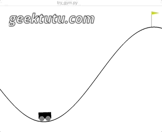
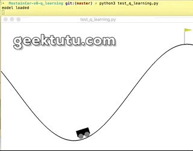

<style>
@media (min-width: 992px) {.gkt-article-start + p > img {min-height: 15rem;}}
.gkt-article-start + p > img {width: auto;}
</style>

这篇文章是 **TensorFlow 2.0 Tutorial** 入门教程的第七篇文章，介绍如何使用强化学习(Reinforcement Learning, RL)的一个经典算法(Q-Learning)，玩转 OpenAI gym game。

**代码仅50行~**

## MountainCar-v0 游戏简介

今天我们选取的游戏是[MountainCar-v0](https://github.com/openai/gym/wiki/MountainCar-v0)，这个游戏很简单，将车往不同的方向推，最终让车爬到山顶。和上一篇文章 [TensorFlow 2.0 (六) - 监督学习玩转 OpenAI gym game](https://geektutu.com/post/tensorflow2-gym-nn.html)一样，我们先介绍几个比较关键的概念，以及这几个概念在这个游戏中的具体含义。


|概念|解释|示例|
|---|---|---|
|State  | list: 状态，[位置，速度] | [0.5,-0.01] |
|Action | int: 动作(0向左推，1不动，2向右推)| 2 |
|Reward | float: 每回合-1分 | -1 |
|Done | bool: 是否爬到山顶(True/False)，上限200回合 | -1 |

如果`200回合`还没到达山顶，说明游戏失败，-200是最低分。每个回合得-1，分数越高，说明尝试回合数越少，意味着越早地到达山顶。比如得分-100分，表示仅经过了100回合就到达了山顶。

## 初始化 Q-Table(Q表)

如果有如下这样一张表，告诉我在某个状态(State)下， 执行每一个动作(Action)产生的价值(Value)，那就可以通过查询表格，选择产生价值最大的动作了。

| State | Action 0 | Action 1 | Action 2|
|---|---|---|---|
| [0.2, -0.01] | 10 | -20 | -30 |
| [-0.3, 0.01] | 100 | 0 | 0 |
| [-0.1, -0.01] | 0 | -10 | 20 |

价值(Value)怎么计算呢？游戏的最终目标是爬到山顶，爬到山顶前的每一个动作都为最终的目标贡献了价值，因此每一个动作的价值计算，和最终的结果，也就是与未来(Future)有关。这就是强化学习的经典算法 `Q-Learning` 设计的核心。`Q-Learning`中的`Q`，代表的是 **Action-Value**，也可以理解为 **Quality**。而上面这张表，就称之为 `Q表(Q-Table)`。

到这里，你应该可以理解了，`Q-Learning`的目的是创建`Q-Table`。有了`Q-Table`，自然能知道选择哪一个Action了。

我们先初始化一张`Q表(Q-Table)`

```python
# q_learning.py
# https://geektutu.com
import pickle # 保存模型用
from collections import defaultdict
import gym  # 0.12.5
import numpy as np

# 默认将Action 0,1,2的价值初始化为0
Q = defaultdict(lambda: [0, 0, 0])
```

## 连续状态映射

但是这个`Q-Table`有一个问题，我们用字典来表示`Q-Table`，State中的值是浮点数，是连续的，意味着有无数种状态，这样更新Q-Table的值是不可能实现。因此，我们需要对State进行线性转换，**归一化处理**。即，将State中的值映射到[0, 40]的空间中。这样，就将无数种状态映射到`40x40`种状态了。

```python
# q_learning.py
# https://geektutu.com
env = gym.make('MountainCar-v0')

def transform_state(state):
    """将 position, velocity 通过线性转换映射到 [0, 40] 范围内"""
    pos, v = state
    pos_low, v_low = env.observation_space.low
    pos_high, v_high = env.observation_space.high

    a = 40 * (pos - pos_low) / (pos_high - pos_low)
    b = 40 * (v - v_low) / (v_high - v_low)

    return int(a), int(b)

# print(transform_state([-1.0, 0.01]))
# eg: (4, 22)
```

## 更新 Q-Table

那怎么更新Q-Table呢？下面这个简化版的公式就是关键了。

> Q[s][a] = (1 - lr) * Q[s][a] + lr * (reward + factor * max(Q[next_s]))

看见公式先别紧张，我们逐步来看。

| 表达式 | 含义 | 简介 |
|---|-----|---|
|s, a，next_s   | - | 当前状态，当前动作，下一个状态 |
|reward     | 奖励 | 执行a动作的奖励 |
|Q[s][a]    | 价值 | 状态s下，动作a产生的价值 |
|max(Q[next_s]) | 最大价值 | 下一个状态下，所有动作价值的最大值 |
| lr | 学习速率(learning_rate) | lr越大，保留之前训练效果越少。lr为0，Q[s, a]值不变；lr为1时，完全抛弃了原来的值。|
| factor | 折扣因子(discount_factor) | factor 越大，表示越重视历史的经验; factor 为0时，只关心当前利益(reward) |

为什么是`max(Q[next_s])`而不是`min(Q[next_s])`呢？在Q-Table中，状态 **next_s** 有3个动作可选，即[0, 1, 2]，对应价值 **Q[next_s][0]，Q[next_s][1]，Q[next_s][2]**。`Q[s][a]`的值应由产生的最大价值的动作决定。

我们想象一个极端场景：五子棋，最后一步，下在X位置赢，100分；其他位置输，0分。那怎么衡量倒数第二步的价值呢？当然是由最后一步的最大价值决定，不能因为最后一步走错了，就否定前面动作的价值。

## 开始训练

接下来我们就把这个公式嵌入到`OpenAI gym`中吧。

```python
# q_learning.py
# https://geektutu.com
lr, factor = 0.7, 0.95
episodes = 10000  # 训练10000次
score_list = []  # 记录所有分数
for i in range(episodes):
    s = transform_state(env.reset())
    score = 0
    while True:
        a = np.argmax(Q[s])
        # 训练刚开始，多一点随机性，以便有更多的状态
        if np.random.random() > i * 3 / episodes:
            a = np.random.choice([0, 1, 2])
        # 执行动作
        next_s, reward, done, _ = env.step(a)
        next_s = transform_state(next_s)
        # 根据上面的公式更新Q-Table
        Q[s][a] = (1 - lr) * Q[s][a] + lr * (reward + factor * max(Q[next_s]))
        score += reward
        s = next_s
        if done:
            score_list.append(score)
            print('episode:', i, 'score:', score, 'max:', max(score_list))
            break
env.close()

# 保存模型
with open('MountainCar-v0-q-learning.pickle', 'wb') as f:
    pickle.dump(dict(Q), f)
    print('model saved')
```

接下来我们来看一看训练效果。因为Q表的状态比较多，因而训练到3000次的时候，仍旧没能成功到达山顶。最终训练结束的时候，分数保持在-150左右，最大分数达到-119。代码中的参数都是随便选取的，如果有时间优化下，肯定能有更好的结果。

```bash
$ python q_learning.py
episode: 3080 score: -200.0 max: -200
episode: 3081 score: -200.0 max: -200
...
episode: 9996 score: -169.0 max: -119.0
episode: 9997 score: -141.0 max: -119.0
episode: 9998 score: -160.0 max: -119.0
episode: 9999 score: -161.0 max: -119.0
model saved
```

## 测试模型

最终，我们写一下测试代码，加载模型，顺便感受下真实的游戏画面吧~

```python
# test_q_learning.py
# https://geektutu.com
import time
import pickle
import gym
import numpy as np

# 加载模型
with open('MountainCar-v0-q-learning.pickle', 'rb') as f:
    Q = pickle.load(f)
    print('model loaded')

env = gym.make('MountainCar-v0')
s = env.reset()
score = 0
while True:
    env.render()
    time.sleep(0.01)
    # transform_state函数 与 训练时的一致
    s = transform_state(s)
    a = np.argmax(Q[s]) if s in Q else 0
    s, reward, done, _ = env.step(a)
    score += reward
    if done:
        print('score:', score)
        break
env.close()
```

运行一下，你就知道。

```bash
$ python test_q_learning.py
model loaded
score: -151.0
```




代码已经上传到[Github - tensorflow-tutorial-samples](https://github.com/geektutu/tensorflow-tutorial-samples/tree/master/gym/MountainCar-v0-q-learning)，**q_learning.py**只有50行，不妨试一试吧~

我们这里的预测模型保存在了`Q-Table`中，输入是State，输出是3个Action的价值，Q-Table是一个字典，有着准确的映射关系，那如果我们用深度神经网络(Deep Neural Network, DNN)模拟这个字典呢？那这就被称为 `DQN(Deep Q-Learning Network)`。好，那我们下一篇文章，就借助`TensorFlow 2.0`用神经网络替换掉`Q-Table`吧。

## 附 推荐

- [一篇文章入门 Python](https://geektutu.com/post/quick-python.html)